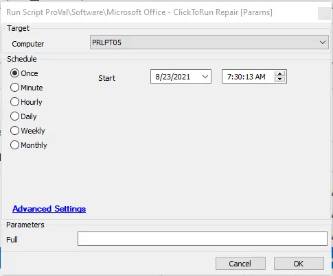

## Summary

This script runs a repair on Office products; by default, it will perform a quick repair, but you can run a full repair by setting the user parameter "Full" to 1.  
**Time Saved by Automation:** 5 Minutes

## Sample Run

## Dependencies

- Applicable to ClickToRun versions

## Variables

`%powershellresult%` - Used to track the Office bit version, either 32 or 64.

#### User Parameters

| Name  | Example | Required | Description                                |
|-------|---------|----------|--------------------------------------------|
| Full  | 1       | False    | Runs a full Office repair on the system    |

## Process

- Checks if `clicktorun.exe` is present on the system.
- If the script finds the executable, it checks whether the installed Office is 32-bit or 64-bit.
- Depending on the bit version, it checks if the user parameter "Full" is set to 1; if it's set, it runs a full repair.
- By default, it runs a quick repair on the machine.

## Output

- Script log
