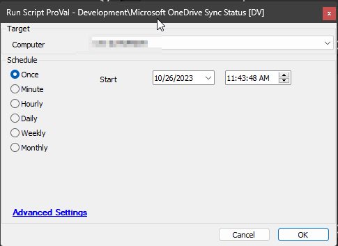

## Summary

This document outlines a script designed to collect OneDrive sync status information from Windows machines exclusively for Non-SharePoint Linked Sites. The script leverages the [Onedrive.dll](https://github.com/rodneyviana/ODSyncService) module to retrieve the requisite data. It is crucial to note that the script necessitates an active user session on the computer to operate effectively.

## Sample Run

## Dependencies

- [EPM - Data Collection - Dataview - Microsoft OneDrive Sync Status [Script]](/docs/5b97dae1-f82c-4ae4-9e21-a5c4e3b1480c)
- [EPM - Data Collection - Internal Monitor - Execute Script - Microsoft OneDrive Sync Status](/docs/b7936e96-423d-4c53-bd95-d10a6c4861f1)

#### Global Parameters

| Name      | Default                                             | Required | Description                                          |
|-----------|----------------------------------------------------|----------|------------------------------------------------------|
| ODFolder  | C:/Windows/LTSvc/Packages/ODFolder                 | True     | Path to write and execute the PowerShell script.    |
| ODFile    | C:/Windows/LTSvc/Packages/ODFolder/ODFile.ps1     | True     | Full path of the PowerShell script.                  |

#### Script States

| Name                          | Example                                                                                                                                                        | Description                                                             |
|-------------------------------|----------------------------------------------------------------------------------------------------------------------------------------------------------------|-------------------------------------------------------------------------|
| OneDriveSyncStatus            | "Sync Status for \"ramkishor\" for \"C:/Users/ramkishor/OneDrive/Desktop\" is \"Synced\"; \"Sync Status for \"ramkishor\" for \"C:/Users/ramkishor/OneDrive/Documents\" is \"Synced\"; \"Sync Status for \"ramkishor\" for \"C:/Users/ramkishor/OneDrive/Pictures\" is \"Not Synced\";" | Stores the result returned by the PowerShell script checking the OneDrive status on the endpoint. |
| OneDriveSyncStatusScriptruntime | 2023-10-26 11:51:02                                                                                                                                         | Stores the data collection time                                       |

## Output

- Script log
- Script states

