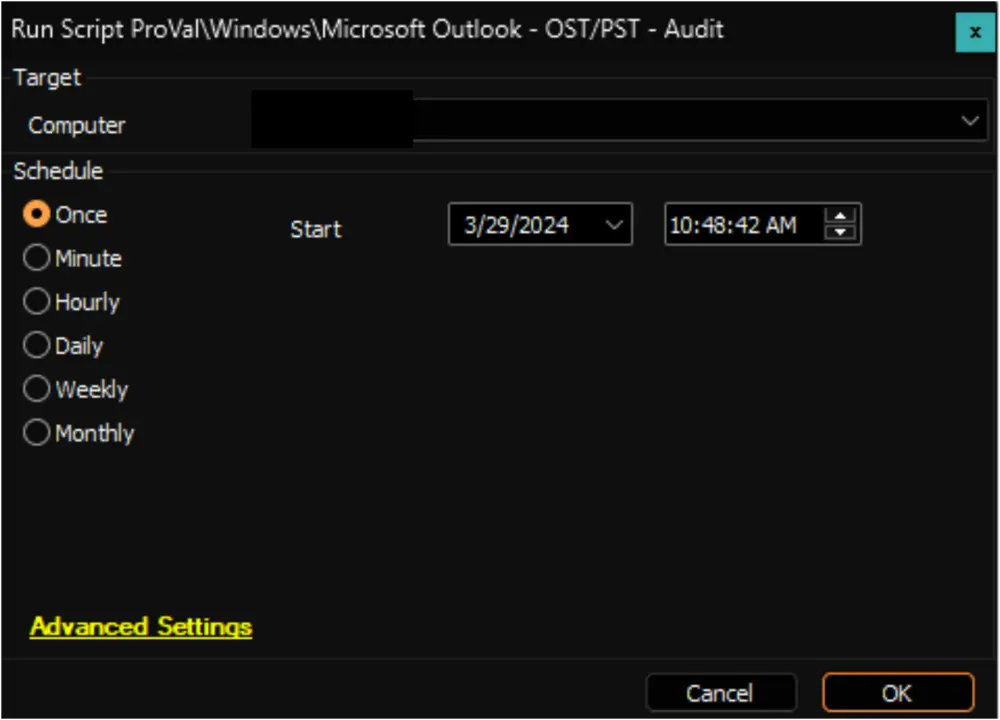

## Summary

This script collects all the OST/PST file names and sizes from Windows machines and stores them in a custom table [EPM - Data Collection - Custom Table - pvl_outlook_pst_ost_audit](/docs/bea56cbb-3761-452a-9493-08a88bc6dbab).

**Script Path:** C:/ProgramData/_Automation/Script/Audit-OutlookDB/Audit-OutlookDB.ps1  
**File Hash:** B5689044612005060B790DFC5560C8E28E44B82BDE107D971AA146B91F147881

## Sample Run

## Dependencies

[EPM - Data Collection - Internal Monitor - Execute Script - Microsoft Outlook - OST/PST - Audit](/docs/d801eb05-05a3-4271-aa8c-a8ea4941f4eb)

## Output

- Script log
- Dataview