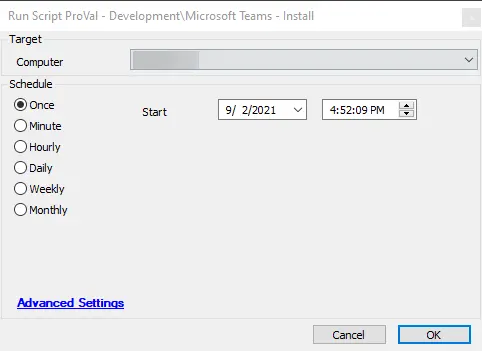

## Summary

This document describes the installation of the Teams Machine-wide Installer and the process to install Teams for the current user. It also covers the creation of a scheduled task to ensure that all users logging into the machine will have Teams installed automatically.

## Sample Run

## Dependencies

- [Deploy-Teams](/docs/512415ba-2cc0-44bc-b0da-84a5e5d02adf)

## Process

Refer to [Deploy-Teams](/docs/512415ba-2cc0-44bc-b0da-84a5e5d02adf) for detailed process information.

## Output

- Script log
- Local file on the computer
