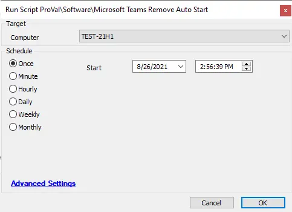

## Summary

This script will remove the autostart entry for MS Teams for all users.

**Time Saved by Automation:** 15 Minutes

## Sample Run

## Process

- This script runs a PowerShell command to remove the registry keys that cause MS Teams to start at login for all users.

## Output

- Script log