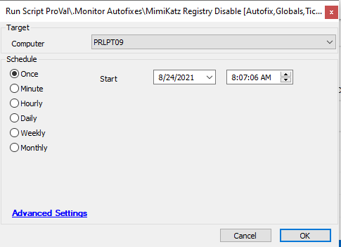

## Summary

This autofix script needs to be set up with the monitor @ProVal - Production - Security - Potential MimiKatz Vulnerable System. The script will disable the MimiKatz registry if the monitor finds it enabled.

**Time Saved by Automation:** 5 Minutes

## Sample Run

## Dependencies

- @ProVal - Production - Security - Potential MimiKatz Vulnerable System

#### Global Parameters

| Name                     | Example | Required | Description                                          |
|--------------------------|---------|----------|------------------------------------------------------|
| Enable Ticketing         | 1       | False    | If you want ticketing enabled, set it to 1         |
| TicketCreationCategory    | 120     | False    | Helps in managing the service board for tickets     |

## Process

- Set the registry value for "HKEY_LOCAL_MACHINE/SYSTEM/CurrentControlSet/Control/SecurityProviders/WDigest/UseLogonCredential" to 0.
- Verify if the changes are successfully made.
- By default, ticketing is enabled, so success or failure tickets are sent for attention.

## Output

- Script log
- Ticket

