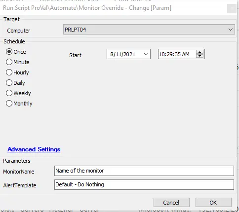

## Summary

This script helps to override the monitor settings applied by a group, allowing you to set a different alert action than the existing group agents.

**Time Saved by Automation:** 5 Minutes

## Sample Run

#### User Parameters

| Name              | Example                                         | Required | Description                                         |
|-------------------|-------------------------------------------------|----------|-----------------------------------------------------|
| Monitor Name      | ProVal - Submitted - AD Recycle Bin State Check | True     | Provide the exact name of the monitor                |
| Alert Template     | Default - Do Nothing                            | True     | The alert name that you would like to set on the agent |

## Process

- Takes input of the Monitor Name and the Alert Template from the user.
- Executes SQL queries to set the override and the alert template.