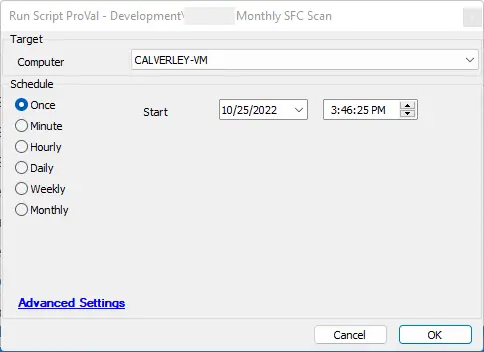

## Summary

This script will run an SFC scan and gather the logs from that scan via console output and the `cbs.log` file. It will check for errors and handle each accordingly. In the event that a repair is needed, this script will run a `dism /online` repair or a SURT repair on Vista-class devices. It will create, update, and complete tickets based on the results of the process.

## Sample Run

## Dependencies

- Must be allowed to create scheduled tasks.
- Must be allowed to create event log items.

## Variables

Document the various variables in the script. Delete any section that is not relevant to your script.

| Name          | Description                                                                                           |
|---------------|-------------------------------------------------------------------------------------------------------|
| surtUrl       | The URL for the SURT file for the given system.                                                     |
| numruns       | The current scan iteration                                                                            |
| DismCount     | The current DISM iteration                                                                            |
| Theme         | Used to pass variables and logs to the logging and upload file section                               |
| SFCResult     | The filtered result of the SFC scan                                                                  |
| CBSResult     | The filtered result of the CBS log file.                                                             |
| Destination   | Derived from splitting a variable that determines the label in the script to go to next              |
| psoutwhy      | Why the destination label to go to was determined.                                                  |
| ImportantInfo | Used for logging and the message body of the ticket for important information relating to a restart being required scenario |
| DismResult    | The result of running a DISM command if necessary.                                                  |

## Process

1. Set up the environment by stopping the `wuauserv` service, renaming the `cbs.log`, and restarting the service.
2. Set any necessary SURT URL.
3. Set any static variables.
4. Start the scanning iteration.
   1. Create any necessary folders and run the SFC scan, gathering only filtered results for logging.
   2. Log and upload any created file.
   3. Get the contents of the CBS log file.
   4. Log and upload any file data.
   5. Determine what steps need to happen next.
      1. If a restart is required:
         1. Set the computer to pending reboot.
         2. Create a `.ps1` file to re-run the SFC scan after reboot as a scheduled task named 'Proval_Script_Monthly_SFC_Scan'.
            1. After reboot:
               1. Clear any necessary files/folders.
               2. Run the SFC scan.
               3. Write an event log:
                  - Provider: 'Proval_Script_Monthly_SFC_Scan'
                  - Event ID: 7395
                  - Log Name: Application
                  - Log Level: Information
               4. Unregister the scheduled job named 'Proval_Script_Monthly_SFC_Scan'.
      2. Log all pertinent information, update the ticket, and exit.
5. If a repair is needed:
   1. Ensure we haven't exceeded the 3rd iteration of the run.
      1. If we have, update the ticket with any pertinent information, log the results, and exit with an error.
   2. Add a ticket comment.
   3. If a Vista-class run, check the SURT:
      1. Determine what label I need to go to.
         1. If a scan is necessary, go back to root step 4.
         2. If not repaired, update the ticket with any pertinent information, log the results, and exit with an error.
         3. If an error occurs, update the ticket with any pertinent information, log the results, and exit with an error.
   4. Start the DISM process:
      1. If it's more than the 3rd attempt, update the ticket with any pertinent information, log the results, and exit with an error.
      2. Run DISM online cleanup.
      3. Filter through the results for anything containing "Warning" or "Error".
      4. Log and upload any files and results.
      5. If the results don't contain "The operation completed successfully", then go back to step 4 and start the DISM process.
      6. Finish the ticket.
      7. Rescan.
6. If an error is found:
   1. Log an error, update the ticket, and exit with an error.
7. If "Not repaired" is found:
   1. Log an error, update the ticket, and exit with an error.
8. If everything is good:
   1. Log the result, finish the ticket, and exit.

## Output

- Script log
- `C:/Temp/CBS.Log`
- `C:/Temp/SFC.Log`
- Application Event log entry 7395 from 'Proval_Script_Monthly_SFC_Scan'
- Ticket with all related information.
