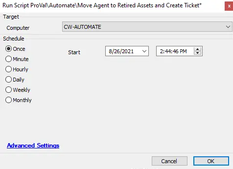

## Summary

This script will create a ticket and move the agent it is run against to retired assets.

**Time Saved by Automation:** 10 Minutes

## Sample Run

## Process

- This script will create a ticket and move the agent it is run against to retired assets.

## Output

- Script log
