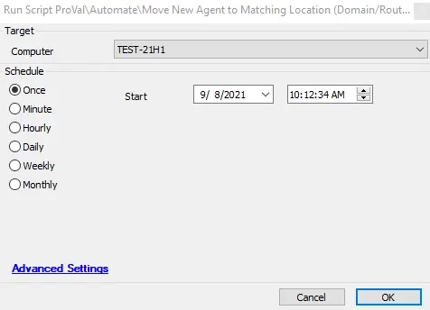

## Summary

This script will move new or unassigned computers from Location ID 1 to the matching locations based on their domain or router address.

**Time Saved by Automation:** 5 Minutes

## Sample Run

## Variables

#### Global Parameters

| Name            | Example | Required | Description                                                                                                                                                                                                                     |
|-----------------|---------|----------|---------------------------------------------------------------------------------------------------------------------------------------------------------------------------------------------------------------------------------|
| ObjectThreshold  | 3       | True     | This is the threshold (number of computers in a location) that the script will check before marking it as a possible location. **Example:** If a target computer has a domain of `TEST.local`, LocationID 4 has three computers with the domain `TEST.local`. It is ignored. LocationID 124 has seven computers with the domain `TEST.local`. It is marked as a possible domain to move the computer to. |

## Process

- The script will run on machines that have LocationID=1.
- The script will fetch all existing domains and will try to match them with the domain of the target computer.
- The script will accordingly move the machine to a location based on the matching domain.
- If no match is found, the script will look for any matching router address for the computer.
- Accordingly, it will move the computer to a location based on the matching router address.
- The script will fail if none of the above conditions are met.

## Output

- Script Log.