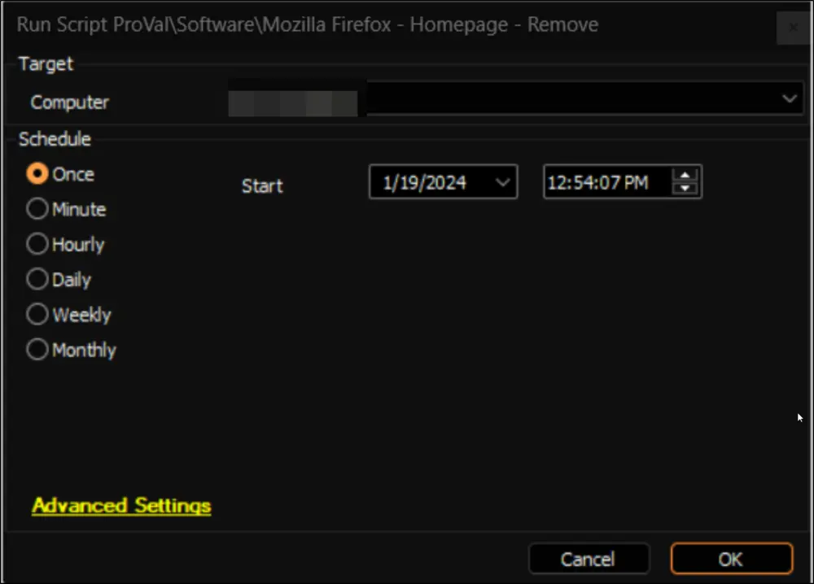

## Summary

This document outlines an Automate implementation of the agnostic script [Remove-FirefoxHomepage](/docs/615b14aa-fee1-4eeb-9e5f-02ad695317d9) to remove the policy for an enforced homepage in Mozilla Firefox.

## Sample Run

## Dependencies

- [Agnostic - Remove-FirefoxHomepage](/docs/615b14aa-fee1-4eeb-9e5f-02ad695317d9)

## Output

- Script Logs