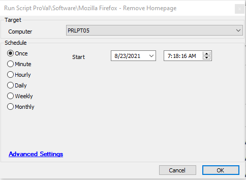

## Summary

This script is used to remove the enforcement of a homepage in the browser.

**Time Saved by Automation:** 5 Minutes

## Sample Run

## Dependencies

- Windows 10 1703+
- Mozilla Firefox
- [Remove-FirefoxHomepage](/docs/615b14aa-fee1-4eeb-9e5f-02ad695317d9  )

## Variables

- `@PS1DataLog@` - Helps to verify if the script actually succeeded.
- `@PS1ErrorLog@` - Helps to track failures of the script.

## Process

The script will scan for and remove all homepage policies from the Firefox policies file. No actions will be taken if no policies are currently being enforced.

## Output

- Script log
- Local file on the computer

