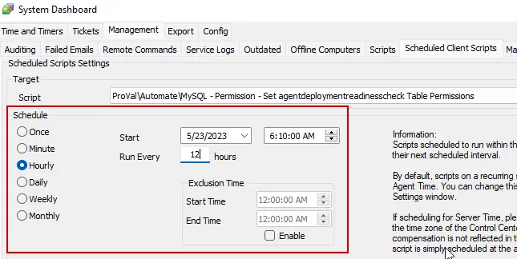

## Summary

This script will gather all users in the database and grant all required permissions for the `agentdeploymentreadinesscheck` table for both Hosted and On-Prem Clients.

**Time Saved by Automation:** 5 Minutes

## Sample Run

The script is converted to a client script and should be scheduled to run every 12-24 hours.

## Variables

| Name              | Description                                                                                             |
|-------------------|---------------------------------------------------------------------------------------------------------|
| UpdateStatements   | This variable will store the SQL result, which will be further used as an update statement to grant permission to the agentdeploymentreadinesscheck table. |

