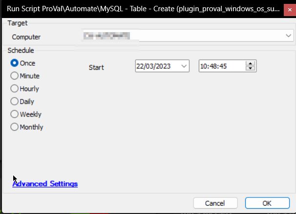

## Summary

The primary purpose of this script is to insert the latest version of the [SEC - Windows Patching - Custom Table - plugin_proval_windows_os_support](/docs/938cd822-f6a3-4ee3-add2-62b407e45622) table.

### References
- [Microsoft Windows | endoflife.date](https://endoflife.date/windows)
- [Windows 10 version history - Wikipedia](https://en.wikipedia.org/wiki/Windows_10_version_history)
- [Windows 11 version history - Wikipedia](https://en.wikipedia.org/wiki/Windows_11_version_history)
- [Microsoft Windows Server | endoflife.date](https://endoflife.date/windows-server)

## Sample Run

