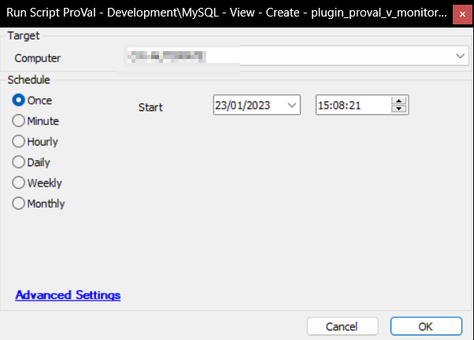

## Summary

This script creates the plugin_proval_v_monitoraudit View, which populates the data in the [CWM - Automate - Dataview - Automate - Monitor Audit [View]](/docs/414e2b20-92a2-40bf-b003-6b92af4cbd18) dataview.

## Sample Run

## Process

- Drops plugin_proval_v_monitoraudit if it already exists.
- Creates plugin_proval_v_monitoraudit.
- Assigns View permissions to all users.

## Output

- View

