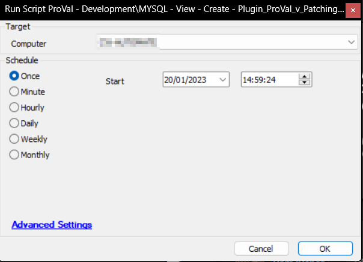

## Summary

This document outlines the process for importing the [plugin_proval_v_patching_metrics_overview](/docs/2a7060e4-0b45-4246-a9ea-f39818cc93e8) view into the database.

## Sample Run

## Process

- Drop the view [plugin_proval_v_patching_metrics_overview](/docs/2a7060e4-0b45-4246-a9ea-f39818cc93e8) if it already exists.
- Create the view [plugin_proval_v_patching_metrics_overview](/docs/2a7060e4-0b45-4246-a9ea-f39818cc93e8).
- Assign permissions for the view to all Automate users.

## Output

- View

