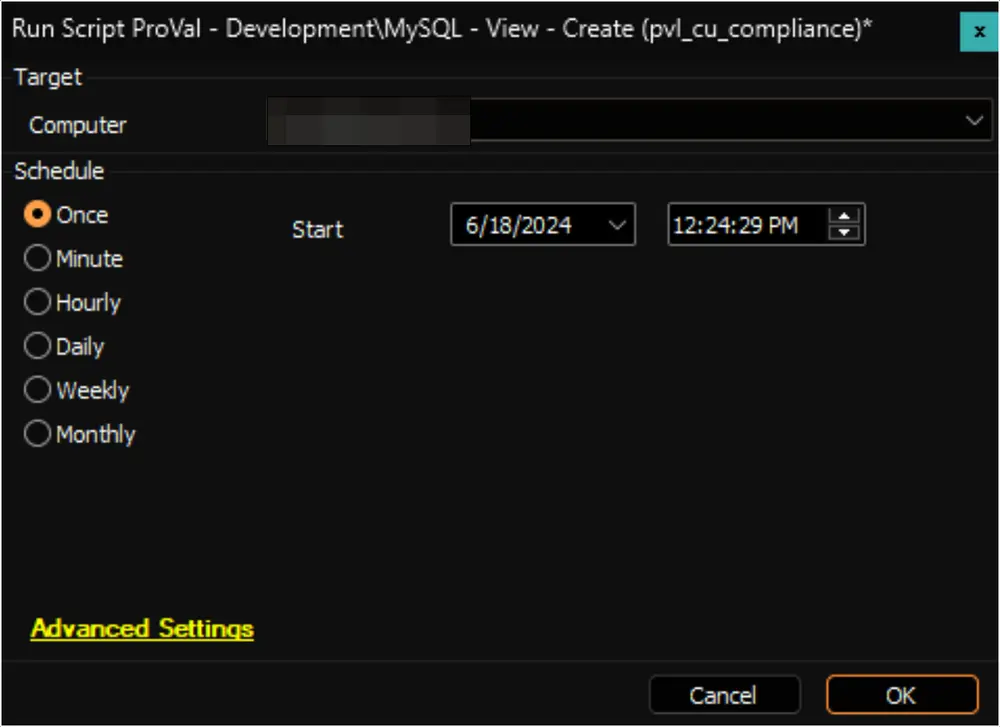

## Summary

The script aims to generate views named `pvl_cu_compliance` and `pvl_cu_compliance_clients`, and subsequently grant access permissions to all currently active Automate users.

Run the script on any computer to create the views, and afterward, remove the script from the environment.

## Sample Run

## Dependencies

- [CWM - Automate - Custom Table - pvl_win_latest_installed_cu](/docs/c03e4def-7efe-4a8b-99e9-d99ac2c65f5a)
- [SEC - Windows Patching - Custom Table - plugin_proval_windows_os_support](/docs/938cd822-f6a3-4ee3-add2-62b407e45622)

## Output

- Custom Views