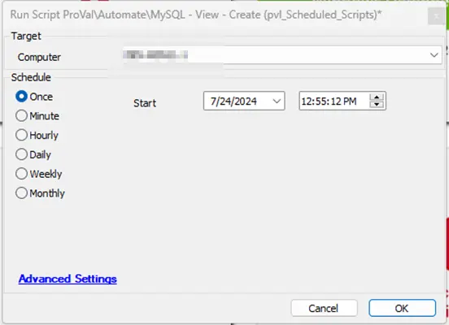

## Summary

The script aims to generate a view named `pvl_Scheduled_Scripts` and subsequently grant access permissions to all currently active Automate users.

Run the script on any computer to create the view, and afterward, remove the script from the environment.

## Sample Run

## Output

- Custom View
