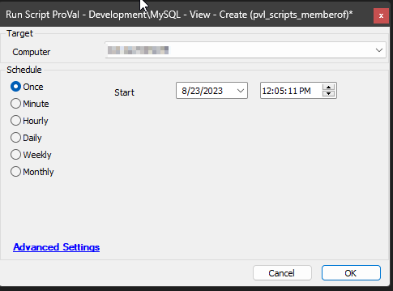

## Summary

The purpose of the script is to create the MySQL View [CWM - Automate - Custom View - pvl_scripts_memberof](/docs/5b888c11-49da-4fea-9bda-9bffdfbb286d) for the [CWM - Automate - Dataview - Scripts - MemberOf](/docs/83b99c1b-d471-41f1-9755-af3a2ab1abf0) dataview.

## Sample Run

