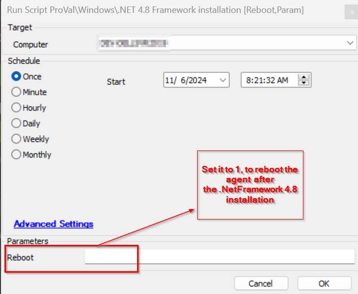

## Summary

The script checks the version of .NET. If version 4.8 is not installed on the machine, it will install it. The machine will also reboot after the installation if the Reboot parameter is set to 1 for a complete installation.

## Sample Run

## Variables

| Name              | Description                                               |
|-------------------|-----------------------------------------------------------|
| FrameWorkStatus    | This stores the .NET Framework 4.8 installation status.  |

### User Parameters

| Name    | Example | Required | Description                                                                                      |
|---------|---------|----------|--------------------------------------------------------------------------------------------------|
| Reboot  | 1       | False    | If this is set to 1, the agent will be restarted for the complete installation of the .NET Framework 4.8. |

## Output

- Script log

