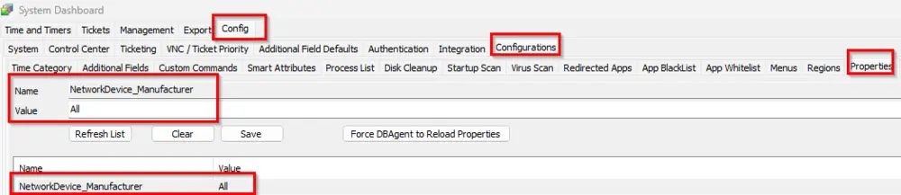

## Summary

This client script aims to set the alert template "△ Custom - Ticket Creation - Offline Network Devices" on the network devices in bulk and also checks the `Send Alert when Unit is Down` EDF based on a global system property specifying which network device manufacturer(s) are requested.

## Sample Run

## User Parameter

| Name             | Example | Required                                     | Description                                                                                                                                                                         |
|------------------|---------|----------------------------------------------|-------------------------------------------------------------------------------------------------------------------------------------------------------------------------------------|
| Set_Environment   | 1       | Need to set to 1 for first-time implementation | Running the script with the user parameter `Set_Environment` as `1` will import System Properties and EDFs needed for the script.                                                |

## Dependencies

[CWM - Automate - Script - Ticket Creation - Offline Network Devices](/docs/1634ea10-264c-44df-abd1-ff68edc23391)  
△ Custom - Ticket Creation - Offline Network Devices

## Variables

| Name               | Description                                                                                                                                                                                                                          |
|--------------------|--------------------------------------------------------------------------------------------------------------------------------------------------------------------------------------------------------------------------------------|
| ManufacturerList    | This stores the Manufacturer parameter value provided in the system property 'NetworkDevice_Manufacturer'. If it is not set, then it stores the value as "No Manufacturer Set".                                                                 |

#### System Properties

| Name                        | Example             | Required | Description                                                                                                                                                                                                                           |
|-----------------------------|---------------------|----------|---------------------------------------------------------------------------------------------------------------------------------------------------------------------------------------------------------------------------------------|
| NetworkDevice_Manufacturer   | Meraki|Ubiquiti    | True     | This includes the devices based on the manufacturer where ticket enabling is required. Please provide value with (|) pipe separated. If you would like to enable offline alerting for all network devices, just place "All" in the system property without quotes. |

## Extra Data Fields

| Name                                          | Level          | Type  | Default | Editable | Description                                                                                                     |
|-----------------------------------------------|----------------|-------|---------|----------|-----------------------------------------------------------------------------------------------------------------|
| Exclude from Offline Network Device Ticketing  | Client-EDF     | Flag  | 0       | Yes      | Check it if you would like to disable a client from Network Device's offline ticketing.                         |
| Exclude from Offline Network Device Ticketing  | Location-EDF   | Flag  | 0       | Yes      | Check it if you would like to disable a location from Network Device's offline ticketing.                       |
| Exclude from Offline Network Device Ticketing  | NetworkDevice-EDF | Flag  | 0       | Yes      | Check it if you would like to disable a Network Device's offline ticketing.                                    |
| Automate Offline Network Device Ticketing Enabled | NetworkDevice-EDF | Flag  | 0       | Yes      | This EDF was checked via a script after performing the offline ticket enabling and the alert template set to "△ Custom - Ticket Creation - Offline Network Devices". |

Client-Level EDF:  
  

Location-Level EDF:  
  

Device-Level EDFs:  
  
  

## Implementation

1. Import the contents  
   - [Script - Ticket Creation - Offline Network Devices](/docs/1634ea10-264c-44df-abd1-ff68edc23391) 
   - Alert Template: "**△ Custom - Ticket Creation - Offline Network Devices**" 
   - Script - Network Devices - Offline Ticket Enabling [Param]

2. Reload the system cache  
     

3. Configure the solution as follows:  
   - Navigate to Automation --> Scripts within the CWA Control Center.  
     - Debug the [Script - Network Devices - Offline Ticket Enabling](/docs/c630e0b8-da8d-4188-aa83-4c4c7e421d92) on any client with User Parameter 'Set_Environment' = 1  
     - It will create the System property required for the script.  
   - Navigate to system dashboard --> Config --> Properties  
     - Fill in the `NetworkDevice_Manufacturer` system property as per partner requirements.  
     - **Important:** Do not proceed with implementing this script unless the consultant provides the type of network devices the partner wants to sync. Contact the consultant to obtain this information.  
     - By default, it remains empty  
         
     - If the partner wants to set offline ticketing for all devices, put "ALL" in the `NetworkDevice_Manufacturer` system property as shown below:  
         
     - If the partner wants to set offline ticketing for a particular manufacturer type of network device like Meraki, Ubiquiti, etc., fill in the system property as shown below. Separate each type with a pipe (|).  
         
     - If the partner wants to remove the offline ticketing from the device script synced earlier, put "Disable" in the system property as shown below:  
         
   - Navigate to system dashboard --> Management --> Scheduled Client Scripts  
     - Schedule the [Script - Network Devices - Offline Ticket Enabling](/docs/c630e0b8-da8d-4188-aa83-4c4c7e421d92) to run daily.  
         
   - If the partner wants to exclude any particular device, location, or client from external sync, select the `Exclude from Offline Network Device Ticketing` EDF respectively on that device, location, or client.  

## Output

- Script log
