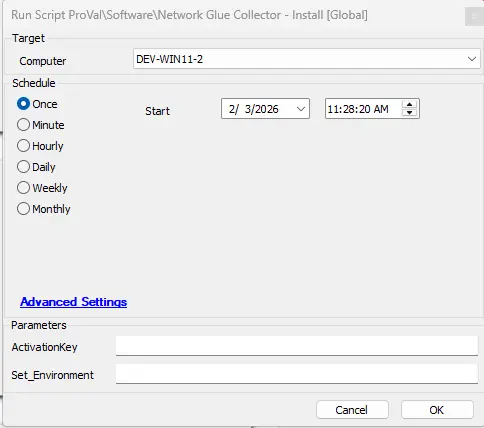

## Summary
This document provides detailed instructions for installing the NetworkGlue Collector, including requirements for the client-specific activation key and the necessary URL for the installer. It outlines user and global parameters, the process for installation, and ticketing information for failed installations.

## File Hash

- **File Path:** `C:\ProgramData\_Automation\Script\Install-NetworkGlueCollector\Install-NetworkGlueCollector.ps1`  
- **File Hash (Sha256):** `D5090A79FFFEE6F406A59AF8CB1139158166F5FB11E91F4D1C60B8BC30C009B8`  
- **File Hash (MD5):** `2D03524B9D7B09C862D15AB4AF44EF58`  

## Sample Run



## Dependencies

- [Solution - Application - Network Glue Collector](/docs/2aceee46-2a96-465d-929d-85de69811a3a)
- [Internal Monitor - ProVal Production - Network Glue - Deployment](/docs/4e0f7314-bf88-44de-a162-139c191e6e09)

#### Global Parameters

| Name                     | Example                             | Required | Description                                                               |
|--------------------------|-------------------------------------|----------|---------------------------------------------------------------------------|
| URL  | https://s3.amazonaws.com/networkdetective/download/NetworkGlueCollector.msi | True    | MSI URL link to install Network Glue Collector|


#### User Parameters

| Name                     | Example                             | Required | Description                                                               |
|--------------------------|-------------------------------------|----------|---------------------------------------------------------------------------|
| Activation Key   | &!GHGSDG$#SHJG7668717%  | False    | This is required to be set with the individual clients activation key found in their IT Glue Networks page to enable auto deployment. |
| Set_Environment  | 1 | 	True (for first execution)   | Run the script with the Set_Environment parameter set to 1 to create the EDFs used by the solution. |

## EDFs

| Name                        | Level   | Type  | Editable | Description                                                                                                                         |
|-----------------------------|---------|-------|----------|-------------------------------------------------------------------------------------------------------------------------------------|
| Network Glue Activation Key  | Client  | Text  | Yes      | This is required to be set with the individual clients activation key found in their IT Glue Networks page to enable auto deployment. |

## Output

- Script Logs
- Ticketing

## Ticketing

<B>Subject</B> :   
```
SW - Network Glue Collector failed to install on %computername%
```

<B>Body</B> :   
```
Network Glue Collector installation failed on %CLIENTNAME%\%COMPUTERNAME% at %LOCATIONNAME%. Please review the log below:

@ErrorLog@.
```

<B>Comment</B> : 
```
Network Glue Collector installation failed again on the %computername% of %clientname%\%locationname%. Please review the log below:

@ErrorLog@.
```
