## Summary

This document describes the process for creating remote monitors to identify new or elevated local administrators on Windows machines. The creation of these remote monitors is based on system properties, as well as client-level, location-level, and computer-level Extra Data Fields (EDFs), which are further explained in this document.

The script generates remote monitors that trigger an alert when a user or group of users is promoted as local administrators on the endpoint machine. By default, it excludes the `Domain Admins` ($Env:DOMAIN/Domain Admins) group from generating tickets, as well as local administrators created by the [Windows Local Admin Process](/docs/f8c0fb81-16ab-4ba2-85ce-d84792a49f6b) solution. Additionally, the system properties, detailed further in the document, can be used to exclude specific users if necessary.

The generated remote monitor `ProVal - Production - New Local Admin` will use the [Get-NewLocalAdmin](/docs/a79af7f1-2ef6-4769-bf7f-b0214e198ac1) agnostic script to perform the monitoring.

**File Path:** `C:/ProgramData/_Automation/Script/Get-NewLocalAdmin/Get-NewLocalAdmin.ps1`

**File Hash:** `D841B4464A5CE301454990B53896118EC57427935335AEDD116024559BA89FFC`

**Note of Caution:** The remote monitors created by this script use PowerShell for monitoring. Therefore, their functionality is not guaranteed on computers running a version of PowerShell older than 5. Please ensure that your systems are updated to at least PowerShell version 5 for optimal performance.

**Exclusion Tips:**

- The word `Domain` can be used to define a domain user or group in the exclusion.  
  Example: If the exclusion is "Domain/Domain Users," then the script will intelligently exclude the "Domain Users" group for all domain-joined computers.
- Adding "Domain/Batman, Batman" to the exclusion system property will exclude both local and domain user "Batman" from generating alerts.

## Important Note

The `ProVal - Production - New Local Admin Monitor` remote monitor will not be created for the machines where the [Local Admin Group Cleanup](/docs/f65e32ea-dd71-436e-bb50-5607d23b8adb) solution is enabled. Additionally, the script will remove the existing monitor after enabling the [Local Admin Group Cleanup](/docs/f65e32ea-dd71-436e-bb50-5607d23b8adb) solution for the machine.

## Update Notice: 27-September-2024

The solution's Extra Data Fields have been modified. Update the script from the `Prosync` plugin and run/debug against any client with `Set_Environment` set to `1` to implement the changes.

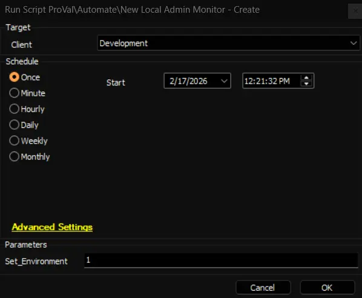

## Implementation

**Remove Existing Monitors**

- Remove the existing `ProVal - Production - New Local Admin` monitor set from the groups it's already applied to.
  - Execute this SQL query from a RAWSQL monitor set to get rid of the existing monitors:  
    `Delete From Groupagents where Name = 'ProVal - Production - New Local Admin'`
  
- Open the 'Server Status' tool by navigating to `Help > Server Status.`  
  

- Click the 'Do Group Refresh' button to refresh and apply the changes made.  
  

- Click 'OK' to the popup message and wait for a minute to allow the changes to take effect.  
  

1. Import the `△ Custom - Ticket Creation - Computer - Failures Only` alert template from the `ProSync` plugin if it's missing in the environment.

2. Import the [New Local Admin Monitor - Create](/docs/c3e994ea-ed6d-4ae8-a4dc-0200d87208d5) script from the `ProSync` plugin.

3. **Run/Debug the Script**  
   - Execute or debug the script against a single client, with the `Set_Environment` parameter set to `1`. This action will generate the necessary system properties and Extra Data Fields (EDFs) for managing the remote monitors.  
   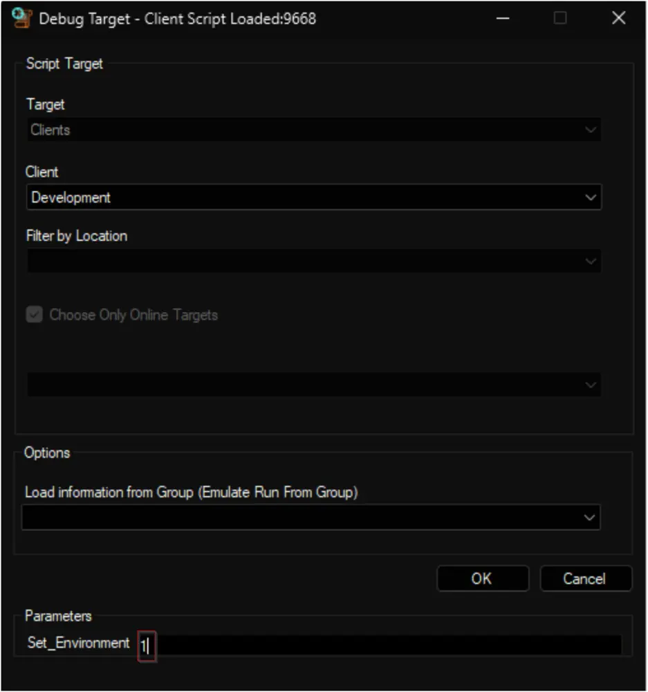  
   

4. **Reload System Cache**  
   - Refresh the system cache to ensure all changes are updated.  
   

5. **Configure System Properties and EDFs**  
   - Navigate to the **System Dashboard -> Config -> Configurations -> Properties**.
   - Find the properties beginning with `NLA_Monitoring`.  
   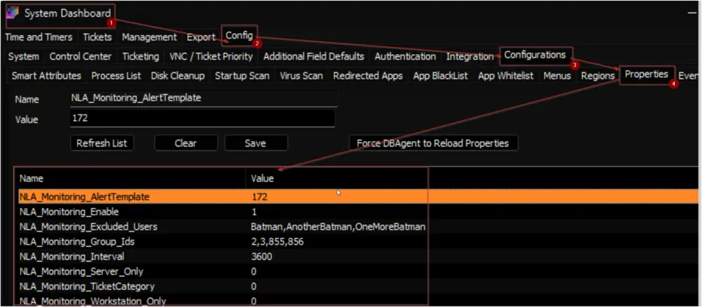  
     The consultant should have provided you with any customizations that are required. Please read through the detailed System Properties and EDF explanations to understand how to configure any customizations.

6. **Schedule the Script**  
   - Schedule the script to run once per day, preferably around midnight, from the dashboard for optimal results.  
   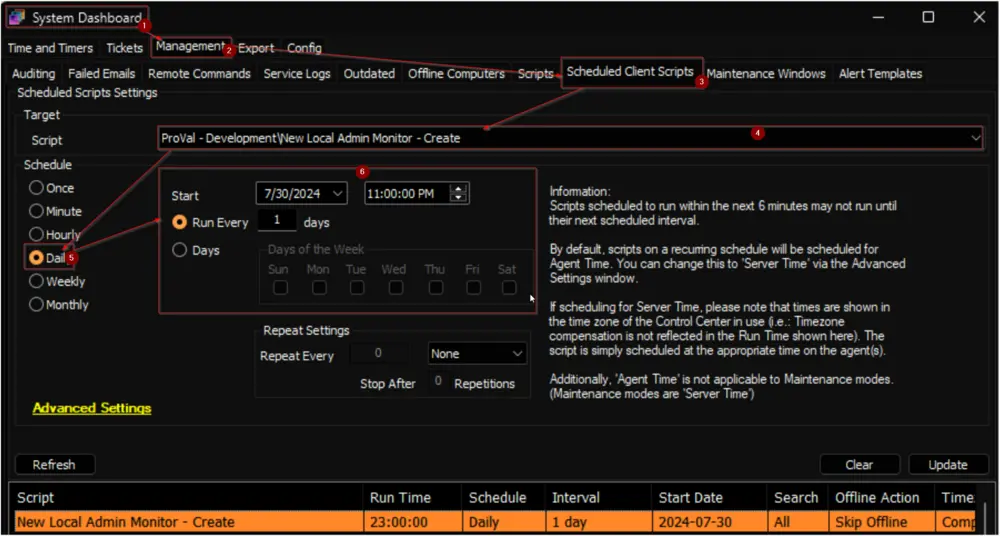

## Dependencies

[EPM - User Management - Agnostic - Get-NewLocalAdmin](/docs/a79af7f1-2ef6-4769-bf7f-b0214e198ac1)

## User Parameters

| Name                | Example | Required               | Description                                                                                                                                                    |
|---------------------|---------|------------------------|----------------------------------------------------------------------------------------------------------------------------------------------------------------|
| Set_Environment      | 1       | True (for first run only) | Set it to 1 during the first run of the script to generate the necessary system properties and EDFs for managing the generated remote monitors.               |

## System Properties

| Name                             | Example           | Required | Description                                                                                                                                                                                                                      |
|----------------------------------|-------------------|----------|----------------------------------------------------------------------------------------------------------------------------------------------------------------------------------------------------------------------------------|
| NLA_Monitoring_Enable            | 1                 | True     | Set this system property to `1` to enable the remote monitor creation for the partner. The default value is `0`.                                                                                                                  |
| NLA_Monitoring_Group_Ids         | 2,3,855,856       | True     | The script will create remote monitors for the machines (Domain Controllers are Excluded) that belong to the groups identified by the group IDs specified in this system property. The monitor set will not be associated with the groups themselves but with the individual machines. Multiple IDs can be included by separating them with a comma.      The default value is `2,3,855,856`.      2, 3, 855, and 856 the default groupids of the default Managed 24x7, Managed 8x5 Workstations and Servers.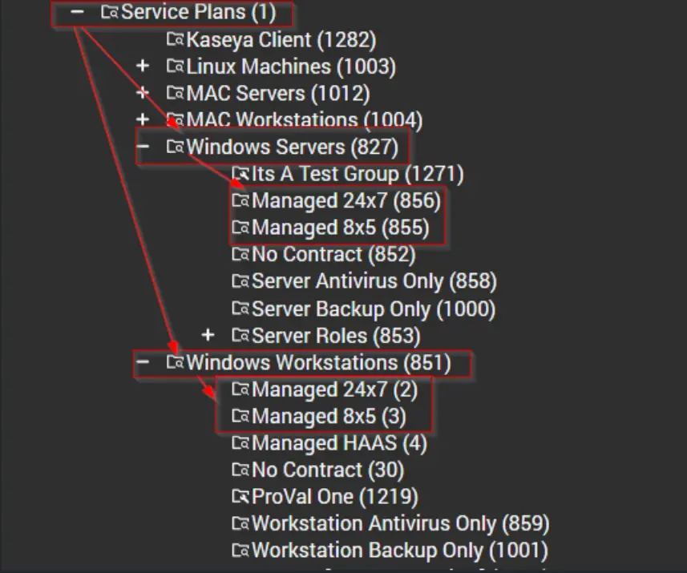   <u> **Note:** </u> If this property is set to ‘0’, the monitoring will be disabled and the script will remove the existing monitor set. Therefore, the creation of the monitor set will not commence unless the group IDs are defined in the system properties.            |
| NLA_Monitoring_Server_Only       | 0                 | False    | Setting this system property to '1' will limit the monitor set creation to the Windows Servers only. The default value is '0'.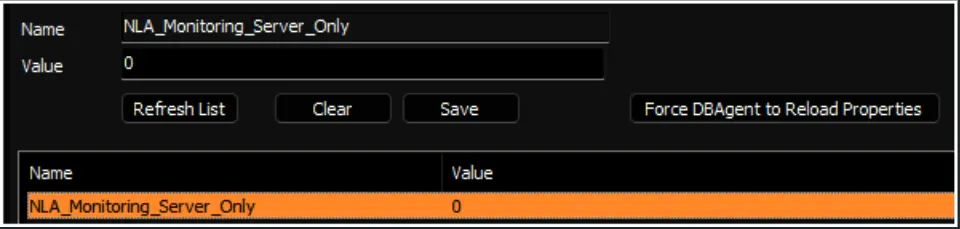   Also, the script will remove the monitor set created for the Windows Workstations after setting this property to '1'.                                                                                              |
| NLA_Monitoring_Workstation_Only   | 0                 | False    | Setting this system property to '1' will limit the monitor set creation to the Windows Workstations only. The default value is '0'.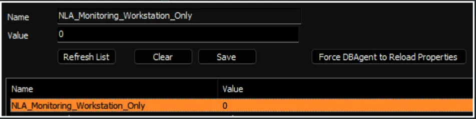    Also, the script will remove the monitor set created for the Windows Servers after setting this property to '1'.                                                                                          |
| NLA_Monitoring_Interval          | 3600              | True     | Controls the generated Remote Monitor run time interval. The default is 3600 seconds.   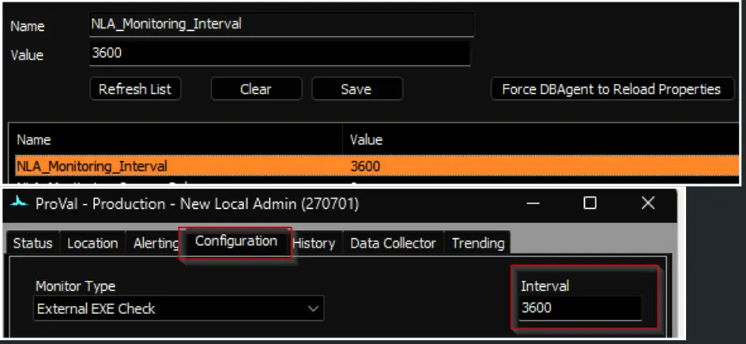                                                                                                                                    |
| NLA_Monitoring_AlertTemplate     | 611               | True     | This system property stores the ID of the `Alert Template` to apply to the created remote monitors. The default value is the TemplateID of the `△ Custom - Ticket Creation - Computer - Failures Only` alert template.      Navigate to the System Dashboard --> Management --> Alert Templates to find the Id of the required alert template. 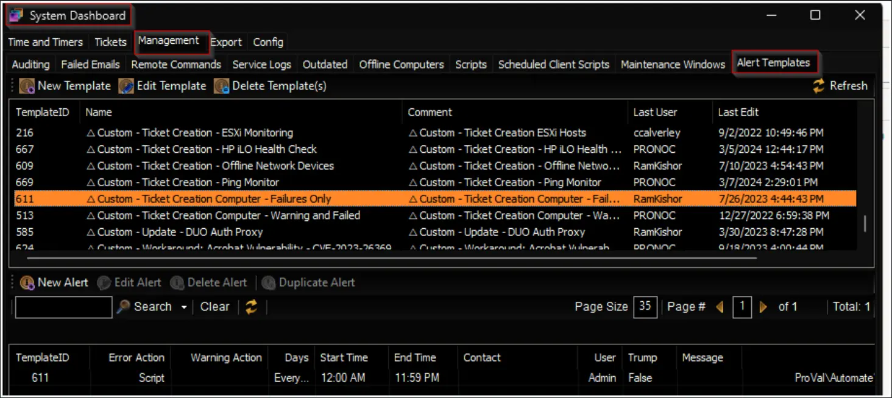    It is suggested to use the `△ Custom - Ticket Creation - Computer - Failures Only` alert for better alerting. The alert template should not be running the very same script for the Warning action as well unless you want to create a ticket for the PowerShell errors too. 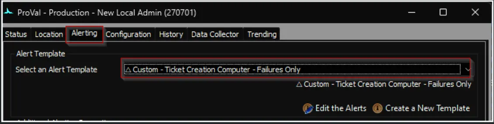   |
| NLA_Monitoring_TicketCategory     | 124               | False    | This system property stores the ID of the `Ticket Category` to apply to the remote monitors created for the machines. The default value is '0', i.e., `<Not Specified>`.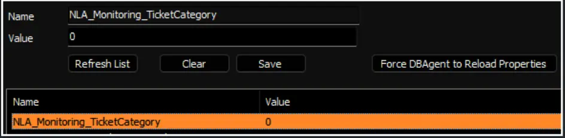     Ticket Categories are used to control the CW Manage service board of the tickets generated by Automate.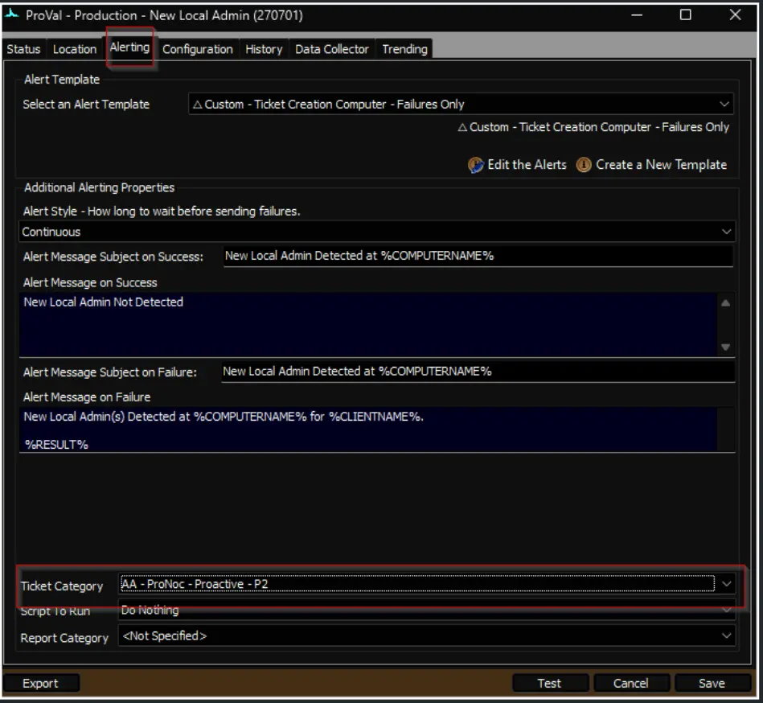      Navigate to the System Dashboard --> Config--> Information Base Categories to find the Id of the required ticket category. 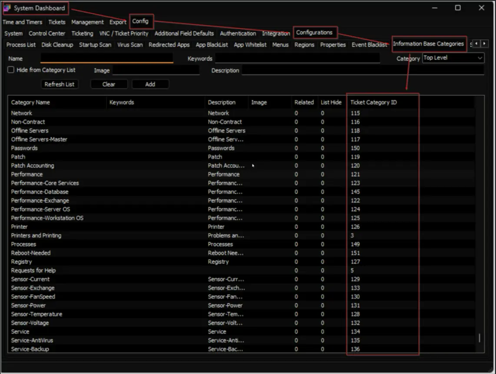                                                   |
| NLA_Monitoring_Excluded_Users    | ClientAdmin, Admin2, User3 | True     | This system property stores the usernames to exclude from generating the new local admin-detected tickets. The default value will be `<blank>`.     The username stored in the `Default_Local_Admin_Account` system property will be excluded from the remote monitor if the Windows Local Admin Process solution is enabled on the machine and it is using the username stored in the system property.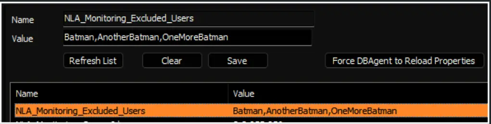    <u>**Note:**</u>  - Multiple usernames can be added by separating them with a comma. To add a domain username, use the following format: DomainName/UserName  Example: Batman,AnotherBatman,OneMoreBatman,Wayne/CommericalBatman.    - The word `Domain` can be used to define a domain user or group into the exclusion  Example: If the exclusion is "Domain/Domain Users" than script will intelligently exclude the "Domain Users" group for all domain joined computers                                                                             |

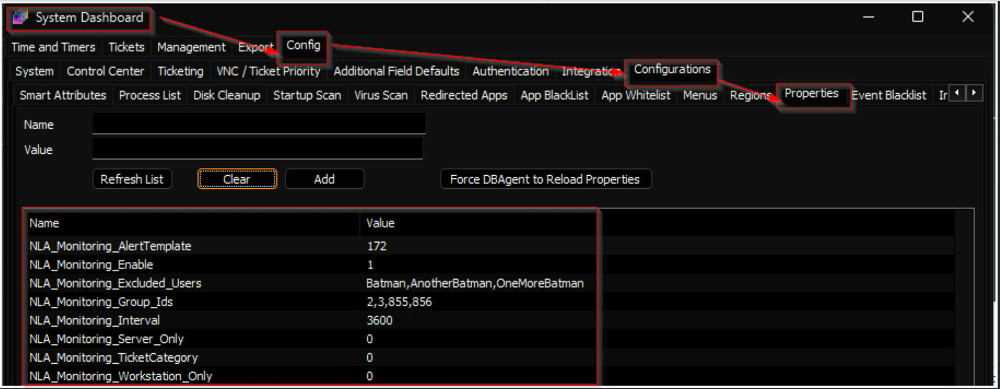

## Client-Level EDF
| Name                                     | Type      | Section             | Description                                                                                                                                                                                                                                        |
|------------------------------------------|-----------|---------------------|----------------------------------------------------------------------------------------------------------------------------------------------------------------------------------------------------------------------------------------------------|
| 3a. New Local Admin Monitor | DropDown | Local Admin Account| Select the appropriate option from the dropdown to manage the `New Local Admin Monitor` creation for the machines of this client. Leave it untouched or select `Enabled for Servers and Workstations` to create the monitors for all machines.   **Available Options:**   - Disabled   - Enabled for Workstations Only   - Enabled for Servers Only   - Enabled for Servers and Workstations   Default Option: Enabled for Servers and Workstations    Leaving this EDF blank is equivalent to enabling for both servers and workstations. 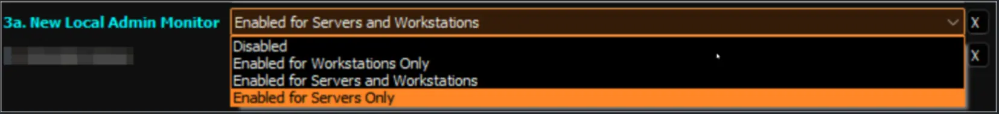
|
| 3b. Excluded_Users                      | Check Box | Local Admin Account | This EDF stores the usernames to exclude from generating the new local admin-detected tickets.   The value stored in this EDF will be added as an additional exclusion, along with the value stored in the `NLA_Monitoring_Excluded_Users` system property. 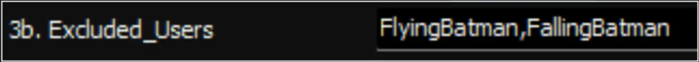   The username stored in the `1c. UserName` EDF will be excluded from the remote monitor if the Windows Local Admin Process solution is enabled on the machine and it is using the username stored in the EDF.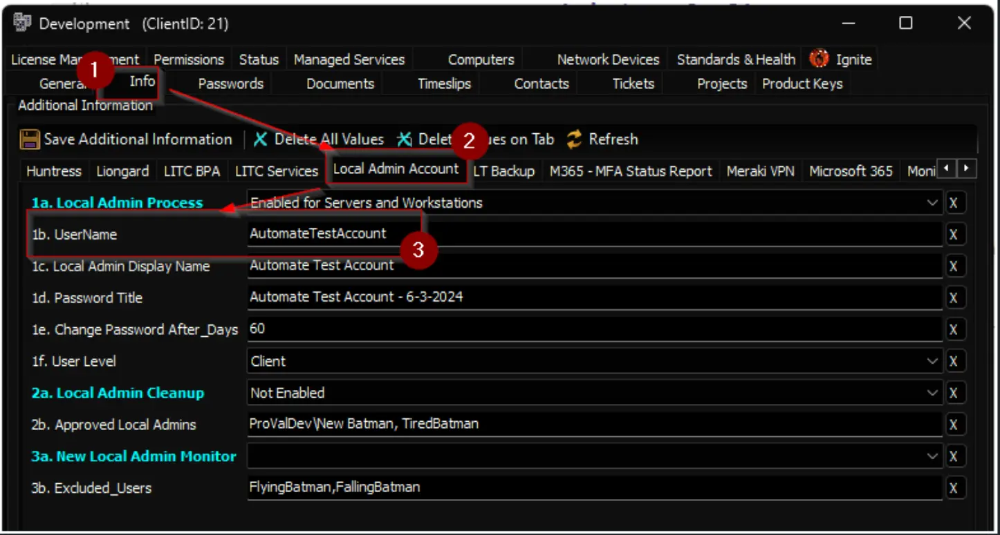    <u>**Note:**</u>   - Multiple usernames can be added by separating them with a comma. To add a domain username, use the following format: DomainName/UserName  Example: Batman,AnotherBatman,OneMoreBatman,Wayne/CommericalBatman   - The word `Domain` can be used to define a domain user or group into the exclusion.  Example: If the exclusion is "Domain/Domain Users" than script will intelligently exclude the "Domain Users" group for all domain joined computers
|

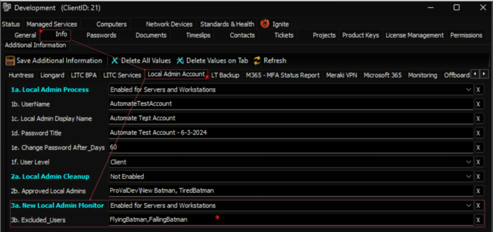

## Computer-Level EDF

| Name                    | Type      | Section        | Description                                                                                                                                                                                                                      |
|-------------------------|-----------|----------------|----------------------------------------------------------------------------------------------------------------------------------------------------------------------------------------------------------------------------------|
| NLAM_Exclude            | Check Box | Exclusions      | Selecting this Extra Data Field (EDF) will exclude the particular computer from the New Local Admin Monitoring. As a result, the script will not create any remote monitors for the computer. Furthermore, upon marking this EDF, the script will also remove any previously created remote monitor. 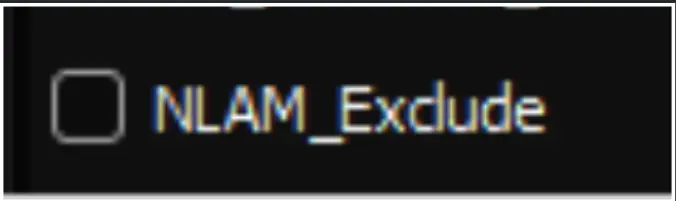|
| NLAM_Excluded_Users     | Check Box | Exclusions      | This EDF stores the usernames to exclude from generating the new local admin-detected tickets. By default it will be a blank text box. The value stored in this EDF will be added as an additional exclusion, along with the value stored in the `NLA_Monitoring_Excluded_Users` system property, and the Client-Level EDF `3b. Excluded_Users`. 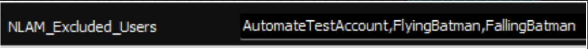    <u>**Note:**</u>  - Multiple usernames can be added by separating them with a comma. To add a domain username, use the following format: DomainName/UserName  Example: Batman,AnotherBatman,OneMoreBatman,Wayne/CommericalBatman   - The word `Domain` can be used to define a domain user or group into the exclusion.  Example: If the exclusion is "Domain/Domain Users" than script will intelligently exclude the "Domain Users" group for all domain joined computers|

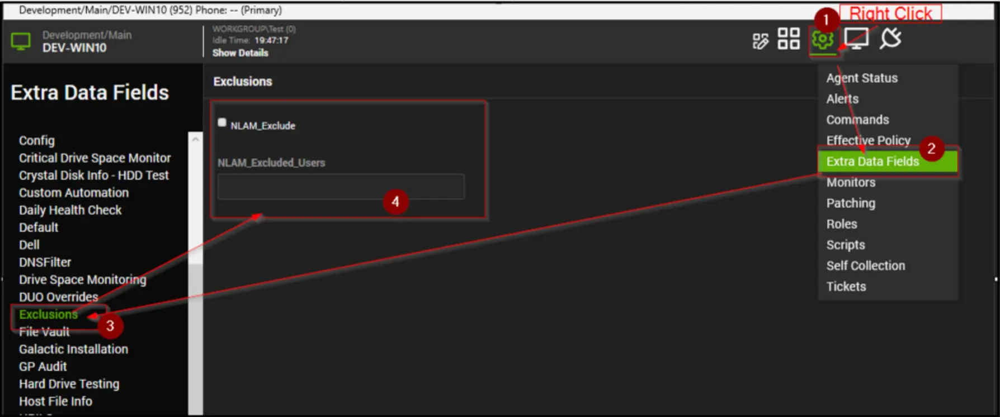

## Remote Monitor Example

**Name:** `ProVal - Production - New Local Admin Monitor`

**Ticket Subject:** `New Local Admin Detected at %COMPUTERNAME%`

**Alert Message on Failure:**  
`New Local Admin(s) Detected at %COMPUTERNAME% for %CLIENTNAME%.`  
`<Newly Created Local Admin(s)>`

**Sample Ticket:**  
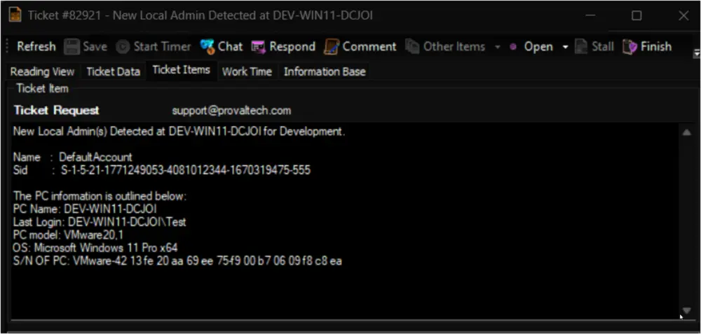  
**Automate will never close the ticket; instead, it will keep adding the new detections to the same ticket as a comment/note, unless the ticket is closed/resolved manually.**

**Sample Remote Monitor:**  
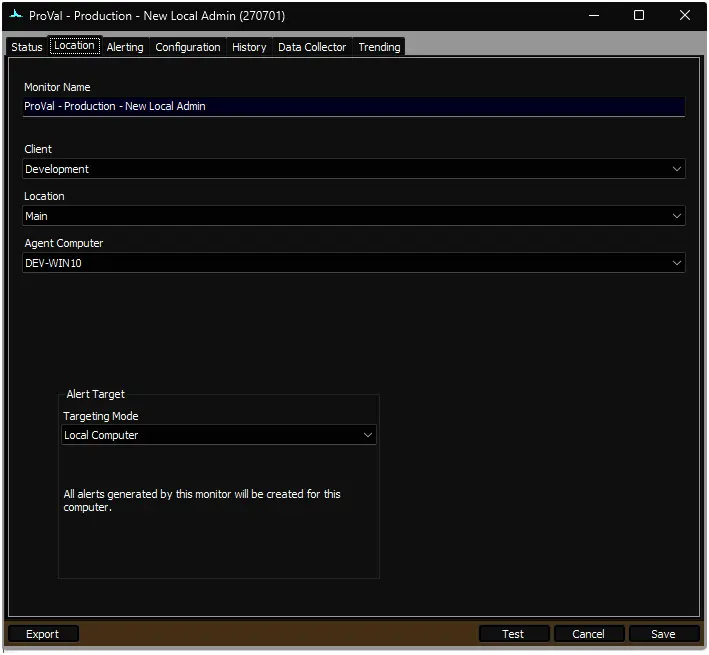  

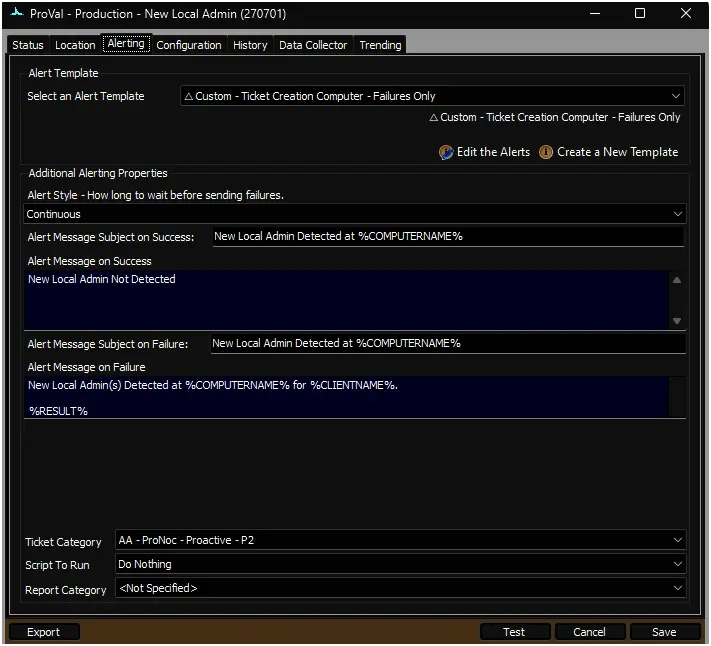  

## Output

- Remote Monitors

## FAQ

**Q.** The remote monitor `ProVal - Production - New Local Admin Monitor` uses a domain role check where 4,5 is excluded. What do those represent?  
**A.** The `DomainRole` property from the `Win32_ComputerSystem` class in PowerShell represents the role of the computer in a domain or workgroup. It returns a numeric value that corresponds to the system's role in the domain or workgroup. The values are as follows:

- **0:** **Standalone Workstation** — The computer is not a member of a domain and is a standalone workstation.
- **1:** **Member Workstation** — The computer is a member of a domain, but it is a client machine (workstation).
- **2:** **Standalone Server** — The computer is not a member of a domain and functions as a standalone server.
- **3:** **Member Server** — The computer is a member of a domain, but it is a server.
- **4:** **Backup Domain Controller (BDC)** — The computer is a Backup Domain Controller (BDC) in the domain. This role holds a copy of the domain database but does not handle user logins by default.
- **5:** **Primary Domain Controller (PDC)** — The computer is a Primary Domain Controller (PDC) in the domain. It handles user logins and manages the domain.

So, the monitor checks whether the `domainrole` is **not** one of 4 or 5, meaning that it continues if the machine is **not** a domain controller.