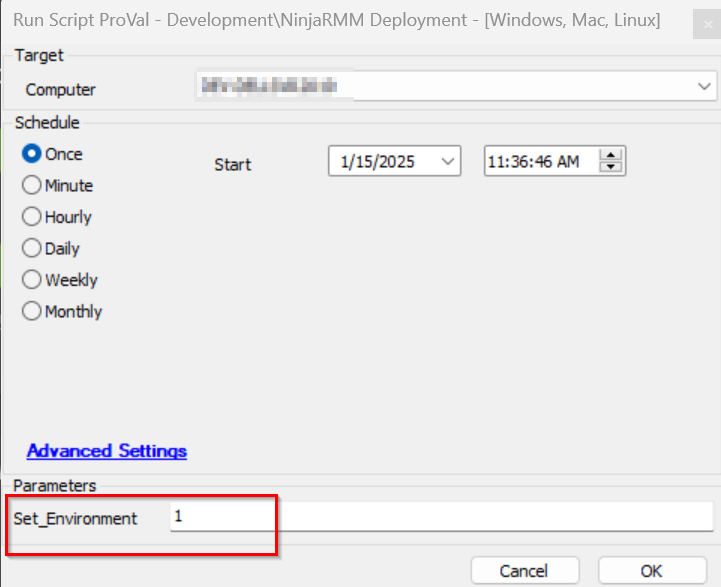
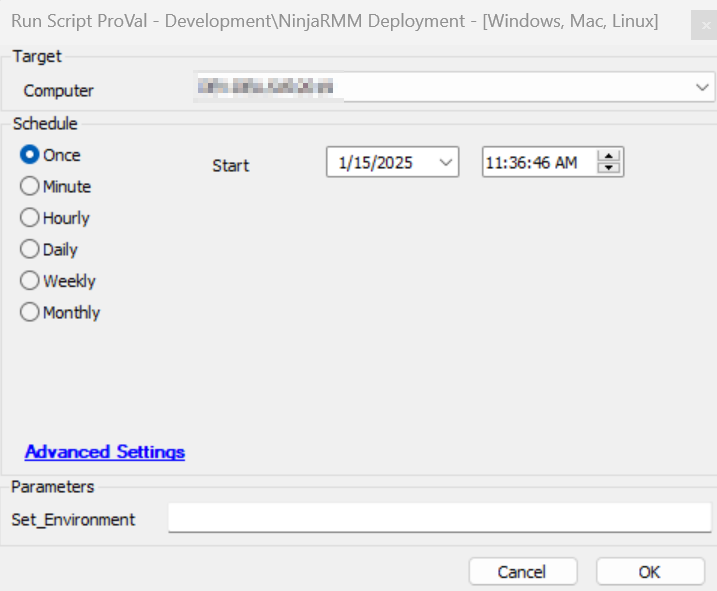

## Summary

This script deploys the NinjaRMMAgent to all supported OS, based on the article provided below:
https://ninjarmm.zendesk.com/hc/en-us/articles/27524794230669-NinjaOne-Agent-Installation-Agent-Tokenization.  
It depends on the Authorization token which will be kept to the client and location EDFs.

## File Hash

`MD5 FileHash` - 700108BC27CD3815939558E784825072

Use this Hash for whitelisting the PowerShell, where the security application is installed on the Windows machines.

## Sample Run

Initially run it by providing the `Set_Environment` value to 1 on any machine so that the EDFs get created:

To deploy the NinjaRMM Agent, execute the script without providing any value to the parameter:

## Dependencies

The NinjaRMM of the partner should have the beta feature enabled to get the Authentication Token key and set it in the EDFs. Refer to the link:
https://ninjarmm.zendesk.com/hc/en-us/articles/27524794230669-NinjaOne-Agent-Installation-Agent-Tokenization

**Note:** To enable this beta feature partner has to request their Account Manager.  

[Solution - NinjaRMM Agent Deployment ](/docs/c42dc847-beeb-4064-80de-3ce936a2ead7)

## User Parameters

| Name               | Example   | Required | Description                                                                                               |
|--------------------|-----------|----------|-----------------------------------------------------------------------------------------------------------|
| Set_Environment    | 1         | False    | It is required to be run with a 1 value at the initial stage during import so that the EDFs get imported. |

## EDFs

| Name               | Level     | EDF Location | Type | Example                              | Required | Description                                                                                               |
|--------------------|-----------|--------------|------|--------------------------------------|----------|-----------------------------------------------------------------------------------------------------------|
| NinjaRMM Org Token | Client    | NinjaRMM     | Text | xxxxxxxx-xxxx-xxxx-xxxx-xxxxxxxxxxxx | True     | It needs to be filled with the Organization token key fetched from the NinjaRMM portal. Refer to the article: https://ninjarmm.zendesk.com/hc/en-us/articles/27524794230669-NinjaOne-Agent-Installation-Agent-Tokenization |
| NinjaRMM Loc Token | Location  | NinjaRMM     | Text | xxxxxxxx-xxxx-xxxx-xxxx-xxxxxxxxxxxx | True     | It needs to be filled with the Location token key fetched from the NinjaRMM portal where the Organization has multiple locations similar to what they had in their CW Automate. Refer to the article: https://ninjarmm.zendesk.com/hc/en-us/articles/27524794230669-NinjaOne-Agent-Installation-Agent-Tokenization     **Note:** The location-level Token has higher priority than the client-level token. |
| NinjaRMM Deployment | Client   | NinjaRMM     | Flag | 1                                    | True     | This Client-EDF is required to be enabled for the NinjaRMM Deployment for the agents of the client.       |
| Exclude NinjaRMM Deployment | Location | Exclusions | Flag | 1                              | False    | If this Location-EDF is checked, then the NinjaRMMAgent deployment will be excluded for the agents of that location. |
| Exclude NinjaRMM Deployment | Computer | Exclusions | Flag | 1                              | False    | If this Computer-EDF if checked, then the NinjaRMMAgent deployment will be excluded for that agent.       |

## Output

- Script log