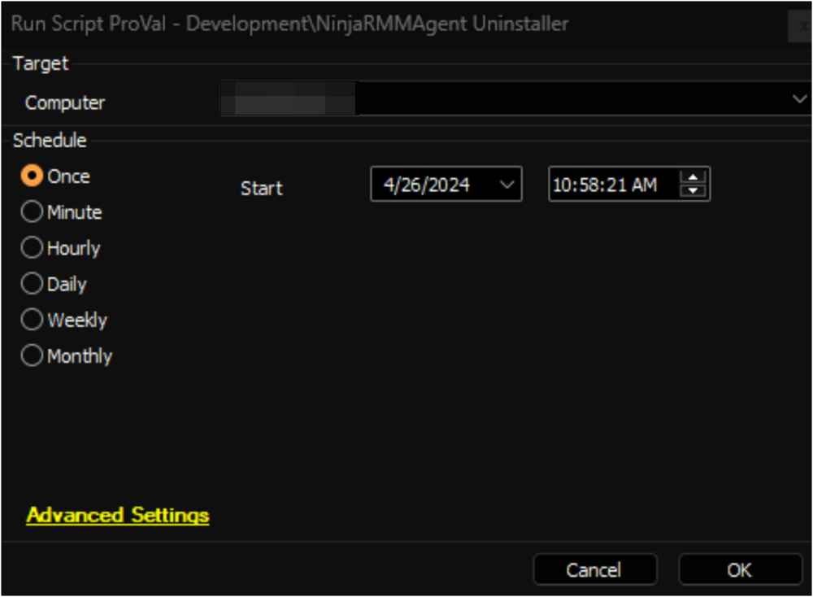

## Summary

The script attempts to uninstall the NinjaRMMAgent from the machine. If the global variable `Ticketing` is set to `1`, it generates a ticket when the uninstallation fails.

## Sample Run

#### Global Parameters

| Name      | Default | Required | Description                                              |
|-----------|---------|----------|----------------------------------------------------------|
| Ticketing | 0       | True     | Set this variable to 1 to enable ticket creation on failure. |

## Output

- Script Log
- Ticket

