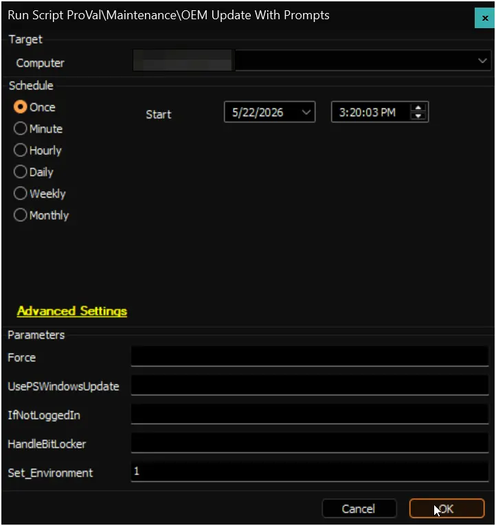
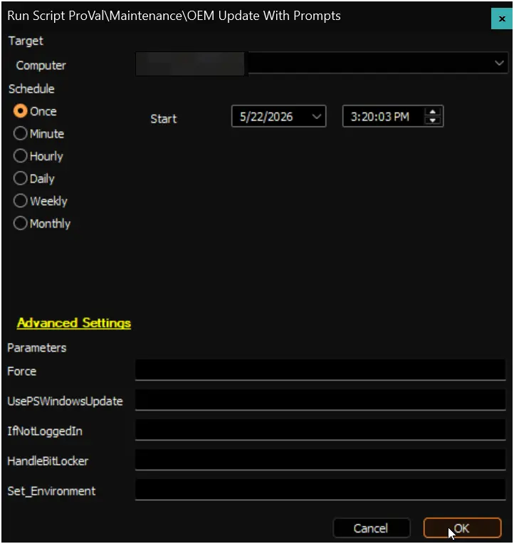
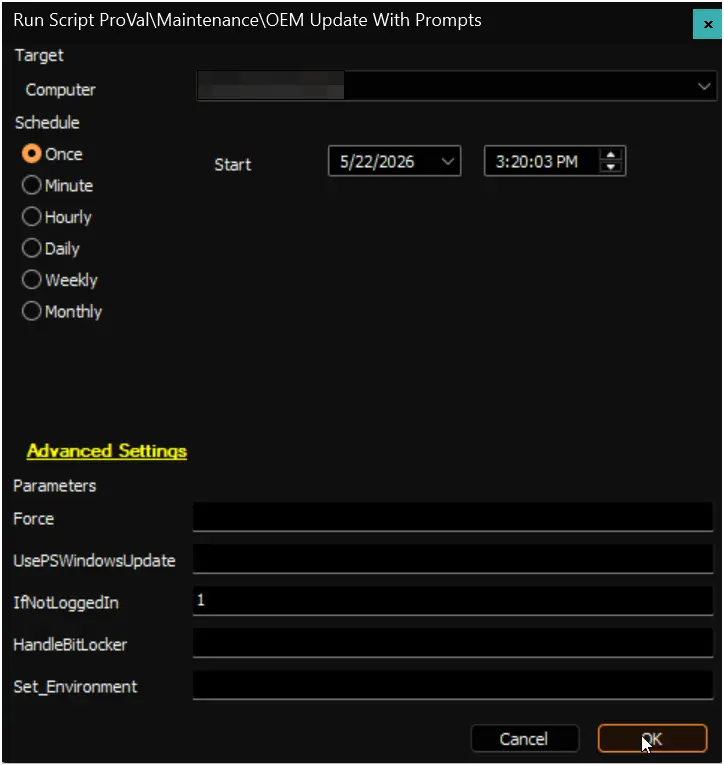
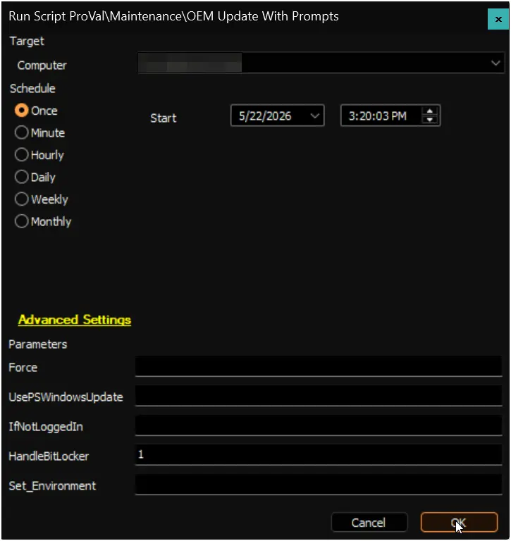
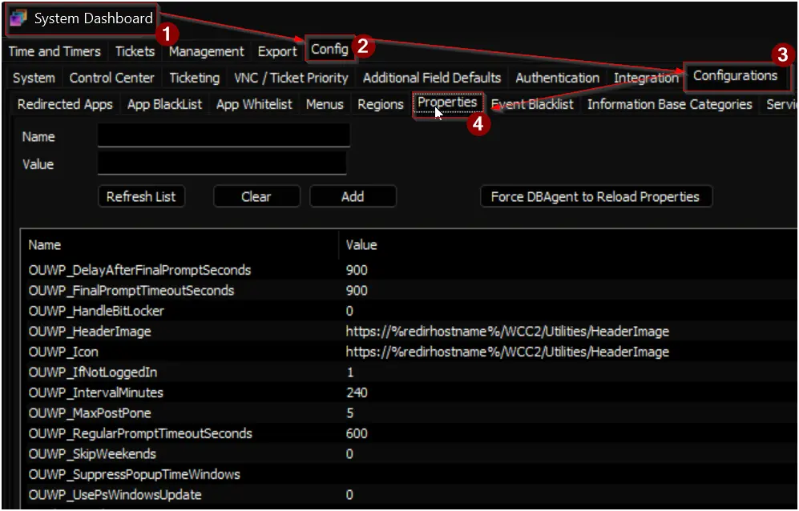
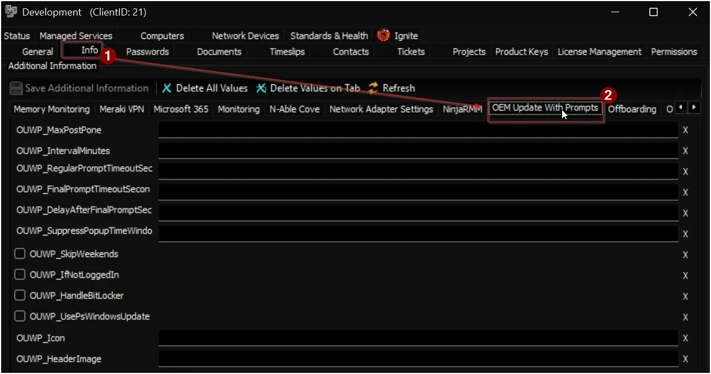

## Summary

This is the ConnectWise Automate implementation of the agnostic script [Invoke-OEMUpdateWithPrompt](/docs/52c50165-38d5-4793-b751-97260ab31f72).

The script prompts logged-in users before BIOS and firmware updates, allows postponement for a configured number of cycles, and then enforces the update. It is designed for a single deployment from Automate, then continues through scheduled task re-runs on the endpoint.

## How Configuration Works

The script reads settings in this order:

1. User parameters passed at runtime (highest priority).
2. Client-level EDF values.
3. System property values.
4. Script defaults in the agnostic payload (if no value exists in Automate).

Only these runtime user parameters are used for update behavior overrides:

- Force
- UsePsWindowsUpdate
- IfNotLoggedIn
- HandleBitLocker

All other behavior should be controlled through client-level EDFs or system properties.

## Dependencies

- [Invoke-OEMUpdateWithPrompt](/docs/52c50165-38d5-4793-b751-97260ab31f72)
- [Prompter](/docs/aba254a9-e917-481d-9152-ecb6e990d98c)
- [Optimize-DotNetRunTime](/docs/6ec8fb3c-29ef-4b05-b8fd-546eb07176c7)
- [Initialize-DellCommandUpdate](/docs/aa963f3d-f149-4bfa-8fdc-30f12c21ce7f)
- [Initialize-HPImageAssistant](/docs/92b749f0-2e30-4d4d-8916-fb5f30d85bff)
- [Install-LenovoUpdates](/docs/3640e534-d089-4304-89ba-68d3bc113978)
- [Install-WindowsUpdates](/docs/3ccc8542-1961-4d3f-a54b-4a1bb9a78edd)

## Sample Run

### First Run (Environment Setup)

Run the script first with Set_Environment set to 1. This creates or refreshes:

- Required system properties.
- Required client-level EDF definitions.

Expected output:

- Properties and EDF definitions are inserted if missing.

### Scenario 1: Default Runtime Using Property Values

Run the script without any override user parameters.

Expected output:

- Script uses system property values for prompt count, interval, timeout, and suppress window.
- Prompt cycle starts and self-reschedules through scheduled tasks.

### Scenario 2: Client-Level EDF Overrides

Set client EDF values for `OUWP_MaxPostPone` and `OUWP_IntervalMinutes`, then run with no user overrides.

Expected output:

- Script uses client EDF values instead of global property values for those settings.
- Remaining settings continue to come from system properties unless also overridden.

### Scenario 3: Runtime Override for UsePsWindowsUpdate

Run with user parameter UsePsWindowsUpdate = 1.

Expected output:

- UsePsWindowsUpdate is enabled for this run even if EDF/property is 0.
- Update execution path uses Install-WindowsUpdates flow.

### Scenario 4: Runtime Override for IfNotLoggedIn

Run with user parameter IfNotLoggedIn = 1.

Expected output:

- If no user session is active, update starts without prompting.
- If a user is logged in, normal prompt workflow continues.

### Scenario 5: Runtime Override for HandleBitLocker

Run with user parameter HandleBitLocker = 1.

Expected output:

- BitLocker is suspended before update execution for one reboot cycle.
- If no reboot is needed, BitLocker is resumed at completion.

### Scenario 6: Force Restart of Prompt Cycle

Run with user parameter Force = 1.

Expected output:

- Existing OEM prompt scheduled tasks are removed.
- Stored prompt state is reset.
- Prompt workflow starts again from the beginning.

## User Parameters

| Name | Example | Required | Description |
| --- | --- | --- | --- |
| Set_Environment | 1 | True (first run only) | Set to 1 on first run to create required system properties and client-level EDF definitions. |
| Force | 1 | False | Highest-priority runtime switch. Resets prompt state and recreates scheduled task workflow. |
| UsePsWindowsUpdate | 1 | False | Highest-priority runtime switch. Uses PSWindowsUpdate path instead of OEM-specific update tools. |
| IfNotLoggedIn | 1 | False | Highest-priority runtime switch. If no user is logged in, runs update without prompt. |
| HandleBitLocker | 1 | False | Highest-priority runtime switch. Suspends BitLocker before update execution. |

## System Properties

| Name | Default | Example | Required | Description |
| --- | --- | --- | --- | --- |
| OUWP_MaxPostPone | 5 | 3 | True | Default maximum postponements before final prompt. |
| OUWP_IntervalMinutes | 240 | 120 | True | Default minutes between prompt attempts. |
| OUWP_RegularPromptTimeoutSeconds | 600 | 600 | True | Default timeout for regular prompts. |
| OUWP_FinalPromptTimeoutSeconds | 900 | 900 | True | Default timeout for the final scheduling prompt. |
| OUWP_DelayAfterFinalPromptSeconds | 900 | 600 | True | Default delay before forced execution after final timeout. |
| OUWP_SuppressPopupTimeWindows | blank | 1800-0900 | False | Optional suppress window in HHmm-HHmm format, for example 1800-0900. |
| OUWP_SkipWeekends | 0 | 1 | False | Optional weekend suppression switch. |
| OUWP_IfNotLoggedIn | 1 | 1 | False | Default unattended behavior when no user is logged in. Can be overridden at runtime. |
| OUWP_UsePsWindowsUpdate | 0 | 1 | False | Default update path selection. Can be overridden at runtime. |
| OUWP_HandleBitLocker | 0 | 1 | False | Default BitLocker handling behavior. Can be overridden at runtime. |
| OUWP_Icon | https://%redirhostname%/WCC2/Utilities/HeaderImage | https://example.com/icon.png | False | Optional icon source for prompt window. |
| OUWP_HeaderImage | https://%redirhostname%/WCC2/Utilities/HeaderImage | https://example.com/header.png | False | Optional header image source for prompt window. |

## Client-Level EDF

All EDF names below are created in the section OEM Update With Prompts and override system properties when populated with valid values.

| Name | Type | Section | Example | Description |
| --- | --- | --- | --- | --- |
| OUWP_MaxPostPone | Text | OEM Update With Prompts | 3 | Overrides OUWP_MaxPostPone for this client. |
| OUWP_IntervalMinutes | Text | OEM Update With Prompts | 120 | Overrides OUWP_IntervalMinutes for this client. |
| OUWP_RegularPromptTimeoutSeconds | Text | OEM Update With Prompts | 600 | Overrides OUWP_RegularPromptTimeoutSeconds for this client. |
| OUWP_FinalPromptTimeoutSeconds | Text | OEM Update With Prompts | 900 | Overrides OUWP_FinalPromptTimeoutSeconds for this client. |
| OUWP_DelayAfterFinalPromptSeconds | Text | OEM Update With Prompts | 600 | Overrides OUWP_DelayAfterFinalPromptSeconds for this client. |
| OUWP_SuppressPopupTimeWindows | Text | OEM Update With Prompts | 1800-0900 | Overrides OUWP_SuppressPopupTimeWindows for this client when format is valid. |
| OUWP_SkipWeekends | Check-Box | OEM Update With Prompts | Marked | Overrides OUWP_SkipWeekends for this client. |
| OUWP_IfNotLoggedIn | Check-Box | OEM Update With Prompts | Marked | Overrides OUWP_IfNotLoggedIn unless runtime parameter is provided. |
| OUWP_UsePsWindowsUpdate | Check-Box | OEM Update With Prompts | Marked | Overrides OUWP_UsePsWindowsUpdate unless runtime parameter is provided. |
| OUWP_HandleBitLocker | Check-Box | OEM Update With Prompts | Marked | Overrides OUWP_HandleBitLocker unless runtime parameter is provided. |
| OUWP_Icon | Text | OEM Update With Prompts | https://example.com/icon.png | Overrides OUWP_Icon for this client. |
| OUWP_HeaderImage | Text | OEM Update With Prompts | https://example.com/header.png | Overrides OUWP_HeaderImage for this client. |

## Output

- Script Logs

### Scheduled Tasks

- Scheduled_Task_Invoke-OEMUpdatePrompt
- Scheduled_Task_Invoke-OEMUpdatePrompt_Reschedule

### Potential Log Files

- C:\ProgramData\_Automation\Script\Invoke-OEMUpdatePrompt\Invoke-OEMUpdateWithPrompt-log.txt
- C:\ProgramData\_Automation\Script\Invoke-OEMUpdatePrompt\Invoke-OEMUpdateWithPrompt-error.txt
- C:\ProgramData\_Automation\Script\Install-OEMUpdates\Install-OEMUpdates-log.txt
- C:\ProgramData\_Automation\Script\Initialize-DellCommandUpdate\Initialize-DellCommandUpdate-log.txt
- C:\ProgramData\_Automation\Script\Initialize-DellCommandUpdate\Initialize-DellCommandUpdate-error.txt
- C:\ProgramData\_Automation\Script\Initialize-HPSupportAssistant\Initialize-HPSupportAssistant-log.txt
- C:\ProgramData\_Automation\Script\Initialize-HPSupportAssistant\Initialize-HPSupportAssistant-error.txt
- C:\ProgramData\_Automation\Script\Install-LenovoUpdates\Install-LenovoUpdates-log.txt
- C:\ProgramData\_Automation\Script\Install-LenovoUpdates\Install-LenovoUpdates-error.txt
- C:\ProgramData\_Automation\Script\Install-WindowsUpdates\Install-WindowsUpdates-log.txt
- C:\ProgramData\_Automation\Script\Install-WindowsUpdates\Install-WindowsUpdates-error.txt

### Sample Prompts - English

  
  

### Completion Acknowledgement Prompt (No Reboot Pending)

## FAQ

**Q: Which Windows versions are supported by this script?**

**A:** This script is supported only on Windows 10 and Windows 11 endpoints. It is not intended for older Windows versions or non-Windows systems.

**Q: Will I get final update success or failure confirmation in ConnectWise Automate script output?**

**A:** Not fully. Automate starts the workflow, but most of the process runs later through scheduled tasks on the endpoint. Because of that, the original script run in Automate will not always show the final status.

**Q: If Automate does not show the final result, where do I check what happened?**

**A:** Check the log files on the endpoint. Those logs contain the best details for completion status and failure reasons.

Common log paths:

- C:\ProgramData\_Automation\Script\Invoke-OEMUpdatePrompt\Invoke-OEMUpdateWithPrompt-log.txt
- C:\ProgramData\_Automation\Script\Invoke-OEMUpdatePrompt\Invoke-OEMUpdateWithPrompt-error.txt
- C:\ProgramData\_Automation\Script\Install-OEMUpdates\Install-OEMUpdates-log.txt

**Q: How do I decide which machines should run this script?**

**A:** First use vendor-specific update audit solutions to identify devices that need OEM driver, BIOS, or firmware remediation, then deploy this script to those targets.

Recommended vendor-specific solutions:

- [Dell Command Update Handler](/docs/5c6d840b-852a-41df-a5e2-08d7d7af564a)
- [HP Image Assistant Handler](/docs/ddf20590-a18c-43f2-9e14-4ce2606187bc)
- [Lenovo System Update Handler](/docs/d801eded-6c8e-413b-852a-5ff83058667b)

## Changelog

### 2026-05-22

- Initial version of the document.
