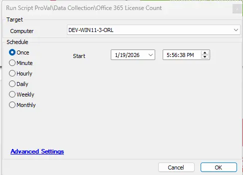

## Summary
The script is designed to fetch license counts from the Office 365 portal. 

The script employs the Microsoft.Graph PowerShell module to establish a connection with the Office 365 portal and generate the report. As there is no provision for a silent or remote connection to the Office 365 portal using Office 365 credentials, the script utilizes the Using PSCredential object method for this purpose.

To effectively use this script, it is imperative to have the Office 365 ClientID, TenantID, and Client Secret. This information can be stored in the client-level EDFs as detailed in the article below.

Please note that this script is designed for professional use and requires a certain level of technical expertise for successful execution. It is recommended to thoroughly understand the script and its requirements before running it.

<I><U>**Note of Caution**</U>: `Its functionality is not guaranteed on any computer running a version of PowerShell older than 5. Please ensure your systems are updated to at least PowerShell version 5 for optimal performance.`</I>

## File Hash

- **File Path:** `C:\ProgramData\_automation\Script\Get-WingetPackageLatestVersion\Get-WingetPackageLatestVersion.ps1`  
- **File Hash (Sha256):** `88C430DB16D0CD9E76C3B3650E76F6D7B06C79F42678F2C65138687EA9C546E7`  
- **File Hash (MD5):** `885A601D6A2A0EA69C8073C165FBAB54`  

## How to create Office 365 ClientID, TenantID, and Client Secret?

### Step 1: Register an Application in Azure AD
- Go to the  Azure Portal → Azure Active Directory → App registrations → New registration.
- Name the app (e.g., "LicenseReportApp").
- Select account type (usually "Accounts in this organizational directory only").
- Click Register.

### Step 2: Generate Client Secret
- Go to Certificates & secrets → New client secret.
- Add a description and choose expiry → Click Add.
- Copy the secret value (you won't see it again).

### Step 3: Assign API Permissions
- Go to API permissions → Add a permission → Microsoft Graph → Application permissions.
- Search for Organization.Read.All → Select it → Add permissions.
- Click Grant admin consent (requires Global Admin).

### Step 4: Note Credentials
- Application (Client) ID: Found on the app's overview page.
- Tenant ID: Found under Azure AD overview.
- Client Secret: From Step 2.

## Dependencies

- [Solution - Office 365 License Count](/docs/8fe2a7a7-4456-4221-80e5-3fb4f2fdb615) 
- [Custom Table - pvl_m365_license_count](/docs/8fe2a7a7-4456-4221-80e5-3fb4f2fdb615) 
- [Internal Monitor - Execute Script – Office 365 License Count](/docs/4b0f8e3f-0efe-49b5-a81b-a617d5940833) 

## Sample Run

## Client-Level EDF

| Name                          | Type      | Example | Section        | Required | Description                                          |
|-------------------------------|-----------|---------|----------------|----------|------------------------------------------------------|
| M365 Client ID | Text Box | 4e9b6c4a-8e38-46a1-9f7c-4f9a1fc3d7f5  | M365 - Details | True    | Office 365 Clientid |
| M365 Tenant ID | Text Box | 78d61825-d966-4a3d-a3a8-5408e8acc66c  | M365 - Details | True    | Office 365 Tenantid |
| M365 Client Secret | Text Box | W/c9zFv622GjDgY+ZaPPFJiO3Z6GpD4R/9a+CT4yGA= | M365 - Details | True    | Office 365 Client Secret |

## Output

- Script Log
- Custom Table
- Dataview