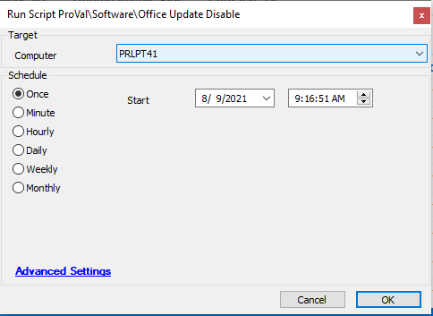

## Summary

This script disables Office updates by running a PowerShell command.

**Time Saved by Automation:** 5 Minutes

## Sample Run

## Process

- Disables Office updates by running a PowerShell command that updates a registry value at `HKLM\SOFTWARE\Microsoft\Office\ClickToRun\Configuration` and sets the `UpdateEnabled` value to `False`.

