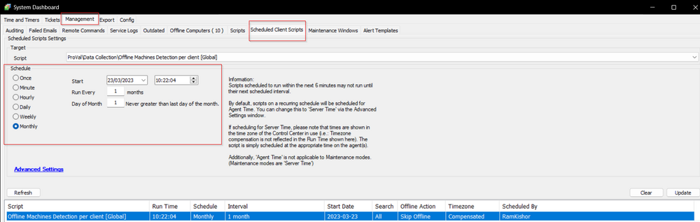

## Summary

Create a client-level ticket with the information of all the machines that have been offline for more than X days.

## Sample Run

  
It is a client script. Schedule it to run every `@Threshold_Offline_Days@` days.

#### Global Variables

| Name                   | Default | Required | Description                                                                                                        |
|------------------------|---------|----------|--------------------------------------------------------------------------------------------------------------------|
| Threshold_Offline_Days | 30      | True     | This sets the threshold for how long offline agents are detected.                                                  |

## Output

- Tickets

## Ticketing

For clients with multiple offline machines:

**Subject:**  
```
LT - X Machines Offline > @Threshold_Offline_Days@ Days at %ClientName%
```

**Body:**  
```
There were X machines found to be offline at %ClientName%. Please review the following list of computers and determine if these can be turned on or if they need to be decommissioned.

The PCs in question have been listed below:
PC Name: %ComputerName1% (Last login: %LastUserName%)
Last Contact: %LastContact%
PC Model: %PCModel% (OS: %OS%)
S/N OF PC: %SerialNumber%

PC Name: %ComputerName2% (Last login: %LastUserName%)
Last Contact: %LastContact%
PC Model: %PCModel% (OS: %OS%)
S/N OF PC: %SerialNumber%

PC Name: %ComputerName3% (Last login: %LastUserName%)
Last Contact: %LastContact%
PC Model: %PCModel% (OS: %OS%)
S/N OF PC: %SerialNumber%
```

**Example:**  
**Subject:**  
```
LT - 8 Machines Offline > 10 Days at Development
```
**Body:**  
```
There were 8 machines found to be offline at Development. Please review the following list of computers and determine if these can be turned on or if they need to be decommissioned.

The PCs in question have been listed below:
PC Name: DEV-SERVER2012R (Last login: DEV-SERVER2012R/Administrator)
Last Contact: 2022-11-04 13:57:20
PC Model: Virtual Machine (OS: Microsoft Windows Server 2012 R2 Standard Evaluation x64)
S/N OF PC: 9167-1404-2630-6589-4651-1615-71

PC Name: DEV-WIN10-2 (Last login: DEV-WIN10-2/Test)
Last Contact: 2023-03-02 11:07:08
PC Model: Virtual Machine (OS: Microsoft Windows 10 Enterprise x64)
S/N OF PC: 8204-9944-0772-2209-1214-6947-22

PC Name: DEV-WIN10-3 (Last login: )
Last Contact: 0000-00-00 00:00:00
PC Model:  (OS: Microsoft Windows 10 Enterprise x64)
S/N OF PC: 8204-9944-0772-

PC Name: DEV-HYPERVHOST (Last login: DEV-HYPERVHOST/Administrator)
Last Contact: 2023-01-23 04:06:35
PC Model: Virtual Machine (OS: Microsoft Windows Server 2022 Standard x64)
S/N OF PC: 0639-6643-9989-8482-7167-0159-76

PC Name: DESKTOP-P8QCK3M (Last login: DESKTOP-P8QCK3M/MyPC)
Last Contact: 2022-11-08 10:53:37
PC Model: 20T1S2A200 (OS: Microsoft Windows 10 Pro x64)
S/N OF PC: PC1QTPZC

PC Name: CALVERLEYWIN7VM (Last login: CalverleyWin7VM/Calverley)
Last Contact: 2023-02-22 15:28:08
PC Model: Virtual Machine (OS: Microsoft Windows 7 Professional x64)
S/N OF PC: 7541-5254-6929-9698-2400-4251-79

PC Name: DESKTOP-T3MCJ00 (Last login: DESKTOP-T3MCJ00/User)
Last Contact: 2023-02-02 00:39:21
PC Model: Virtual Machine (OS: Microsoft Windows 10 Pro x64)
S/N OF PC: 5321-4078-3633-5397-0764-9709-12

PC Name: DEV-W81-CALV (Last login: DEV-W81-CALV/chris)
Last Contact: 2023-02-16 13:52:03
PC Model: Virtual Machine (OS: Microsoft Windows 8.1 Pro x64)
S/N OF PC: 7236-6914-8520-4476-5686-2377-81
```

For clients with a single offline machine:

**Subject:**  
```
LT - %computername% offline > @Threshold_Offline_Days@ days at %ClientName%/%LocationName%
```

**Body:**  
```
The computer %computername% at %ClientName%/%LocationName% has not checked in since %LastContact%. Please find out why this machine is offline and if it should be decommissioned.

The PC information is outlined below:
PC Name: %ComputerName% (Last login: %LastLoggedonUser%)
Last Contact: %LastContact%
PC Model: %PCModel%
OS: %OS%
S/N OF PC: %SerialNumber%
```

**Example:**  
**Subject:**  
```
LT - DEV-WIN10-3 offline > 90 days at Development/Dev
```
**Body:**  
```
The computer DEV-WIN10-3 at Development/Dev has not checked in since 2023-02-22 15:28:08. Please find out why this machine is offline and if it should be decommissioned.

The PC information is outlined below:
PC Name: DEV-WIN10-3 (Last login: DEV-WIN10-3/User)
Last Contact: 2023-02-22 15:28:08
PC Model: Virtual Machine
OS: Microsoft Windows 10 Enterprise x64
S/N OF PC: 8204-9944-0772-5397-0764-9709-12
```


