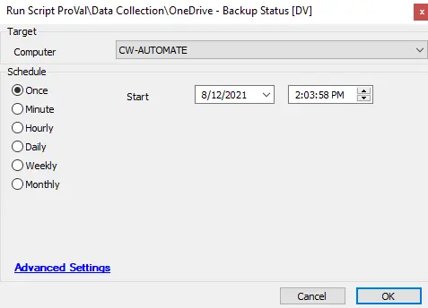

## Summary

This script gathers information about the status of the built-in OneDrive backup functionality for the currently logged-in user.

**Time Saved by Automation:** 10 Minutes

## Sample Run

## Dependencies

- [OneDrive - Backup Status](/docs/b11f38e6-4a69-4f26-9317-46c30f531640)  
- [EPM - Windows Configuration - Custom Table - plugin_proval_onedrivebackupstatus](/docs/e8a689d5-5075-416d-a38c-c0bb09487825)

## Output

- Script log
- Custom table
- Dataview

