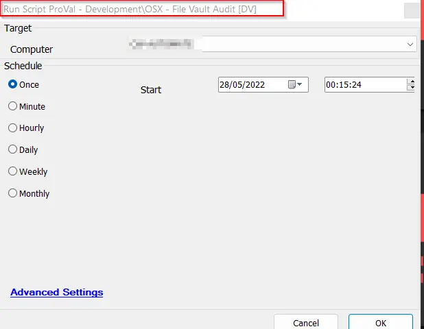

## Summary

This script retrieves the File Vault Status of a Mac machine and stores it in a computer-level EDF called "File Vault Status."

## Sample Run

It is recommended to schedule the script to run daily against the Mac machines to keep the data view up-to-date.

## Dependencies

[File Vault Audit](/docs/e64d9e93-4fd1-4643-8ffe-bc62492ed6cc)

## Process

1. Execute the `fdesetup status` command to fetch the FileVault's status.
2. Update the current time in the "File Vault Script Run Time" EDF.
3. Update the outcome of the command in the "File Vault Status" EDF.

## Output

- EDF
