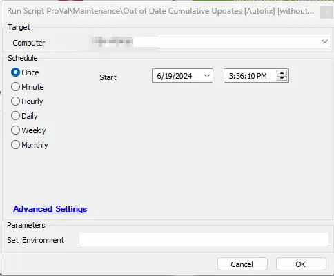
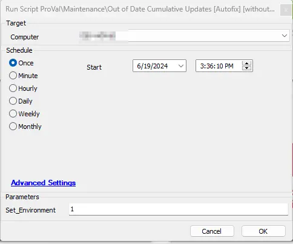

## Summary

This Autofix script is designed to initiate the installation of the latest available Cumulative Update on computers identified by the [CWM - Automate - Internal Monitor - Last Cumulative Update > 45 Days and < 60 Days](/docs/6a68b349-fa31-41d0-9a6c-80eef1a13fdb). The script includes basic troubleshooting steps to ensure a smooth patch installation process. Essentially, this script is a version of the [CWM - Automate - Script - Out of Date Cumulative Updates [Autofix]](/docs/dedb8564-bb1a-47b8-9525-61fc9e690cae) script. It is designed to fix issues on machines before creating any tickets, thereby limiting the number of tickets generated by the [CWM - Automate - Script - Out of Date Cumulative Updates [Autofix]](/docs/dedb8564-bb1a-47b8-9525-61fc9e690cae) script.

## Sample Run

This Autofix script is intended for implementation through the [CWM - Automate - Internal Monitor - Last Cumulative Update > 45 Days and < 60 Days](/docs/6a68b349-fa31-41d0-9a6c-80eef1a13fdb) monitor set, using the `△ Custom - Autofix - Out Of Date Cumulative Updates without Ticketing` alert template. However, it can also be manually executed simultaneously.

## Implementation

- Import the script from the `ProSync Client` plugin.
- During the initial execution, run the script against a Windows computer with the script parameter `Set_Environment` configured as `1`. This action will import the necessary System Properties required for solution management.  
  
- Configure the necessary values within the system properties, as elaborated in the System Properties section of the document.

## Dependencies

- [EPM - Windows Update - Script - Get Latest Installed Cumulative Update](/docs/bd99d6b2-2d31-4611-9682-3c8518c53998)
- [CWM - Automate - Internal Monitor - Patches Not Installing > 60 Days](/docs/663a6cf8-f3da-4a44-9725-73aae8d4d954)
- [EPM - Windows Configuration - Solution - User Prompt for Reboot](/docs/32d2254e-c2a4-4f2d-a029-b74f6d3c8b1a)
- [SEC - Windows Update - Agnostic - Repair-WindowsUpdate](/docs/39345bfd-d9e2-4e68-9d7a-3e8b443140cc)

## System Properties

| Name                                   | Default | Required | Description                                                                                              |
|----------------------------------------|---------|----------|----------------------------------------------------------------------------------------------------------|
| Out_of_Date_CU-Autofix_for_Servers    | 0       | False    | Assign a value of 1 to enable Autofix for servers; by default, the script will only generate a ticket for servers. |

## Script States

| Name                     | Example     | Description                                                                                                                                                                                                                          |
|--------------------------|-------------|--------------------------------------------------------------------------------------------------------------------------------------------------------------------------------------------------------------------------------------|
| Out_of_Date_CU_Stage    | Validation  | To monitor the progress of the validation on the computer, the Script state is also utilized in the [Internal Monitor - Last Cumulative Update > 75 Days ago](/docs/a835c448-fd00-4807-a3b2-8f1066e1a682) monitor set. This helps prevent duplicate executions of the script for the same computers. |

## Output

- Script Log