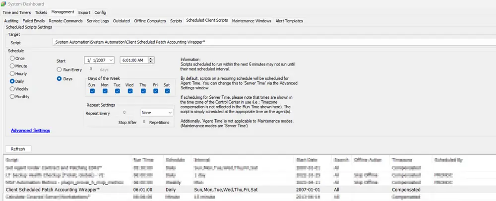
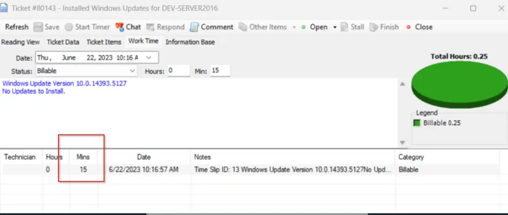

## Summary

This script is a function script and is the enhanced version of the default "Patch Accounting" script. It creates tickets for successful patch jobs and optionally bills flat time or actual install time on the ticket. The default script was not able to add the actual time taken by the patch jobs in the tickets properly. This script adds the exact time taken by the patch job into the patching tickets. The default time added to the ticket will be 15 minutes if the time taken by the patch job is less than 15 minutes; otherwise, it will add the exact time taken by the patch job. All tickets are finalized at the end of the script.

## Sample Run

This script is called by the default script "Client Scheduled Patch Accounting Wrapper," which simply runs this script. This wrapper script should be scheduled to run on the Labtech Server once every 24 hours after the patch install window.

## Variables

| Property                      | Value |
|-------------------------------|-------|
| _sysPatchAcctTicketJobSuccess | 1     |
| _sysPatchAcctTimeToBill       | 1     |

## Output

This script will add the time to the ticket created.

