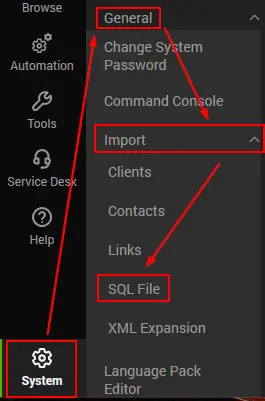

## Step 1
Please download the 'PatchComplianceReports.SQL' file attached to this document.

---

## Step 2
Import the file using **System** → **General** → **Import** → **SQL File** (The SQL file is too large for a remote monitor).

**Note:** Import the SQL file only after importing the [Script - Create Views for Patch Compliance Report](/docs/7174f88a-38fc-4e5a-83cc-1f48a6c29526) and running it once.
## Attachments
[PatchComplianceReports.sql](<../../../static/attachments/itg/17898232/PatchComplianceReports.sql>)