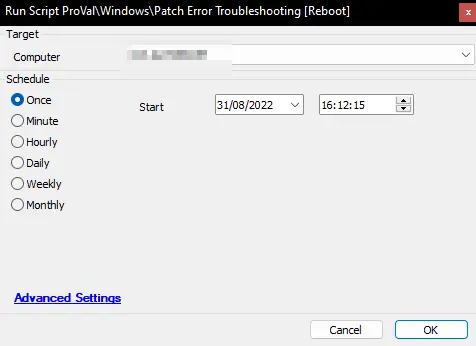

## Summary

This script helps to reset all the Windows Update components. It performs actions such as:

- Stopping the Windows Update, BITS, CryptSvc, and AppIdSvc services.
- Removing `%ALLUSERSPROFILE%/Application Data/Microsoft/Network/Downloader/qmgr*.dat`
- Removing `C:/Users/All Users/Microsoft/Network/Downloader/qmgr*.dat`
- Renaming the SoftwareDistribution folder to SoftwareDistribution.bak
- Renaming the Catroot2 folder to Catroot2.bak
- Resetting all Windows Update DLLs
- Performing a Winsock reset
- Starting the Windows Update, BITS, CryptSvc, and AppIdSvc services.

Reboot the computer.

**Time Saved by Automation:** 20 Minutes

## Sample Run

**Target:** Windows Device  
**Note:** This script will forcefully reboot the target device. It may not be ideal to run this script during business hours.

## Process

1. Create a .BAT file in the `C:/temp/` folder, and the script will execute the .BAT file.
   1. The .BAT file will stop and then start several services and delete or rename some files (View all actions below).
      1. Stop services: Windows Update, BITS, CryptSvc, and AppIdSvc.
      2. Delete `%ALLUSERSPROFILE%/Application Data/Microsoft/Network/Downloader/qmgr*.dat`
      3. Delete `C:/Users/All Users/Microsoft/Network/Downloader/qmgr*.dat`
      4. Rename the SoftwareDistribution folder to SoftwareDistribution.bak
      5. Rename the Catroot2 folder to Catroot2.bak
      6. Reset all Windows Update DLLs
      7. Perform a Winsock reset
      8. Start services: Windows Update, BITS, CryptSvc, and AppIdSvc.

## Output

**Script logs**
