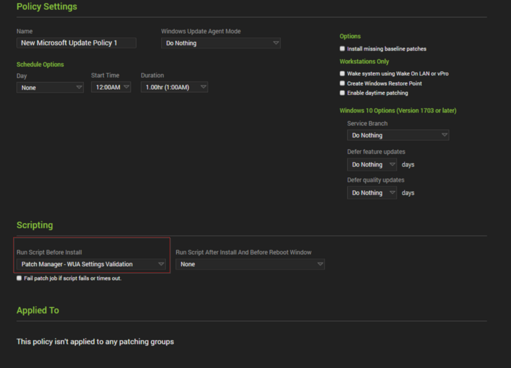
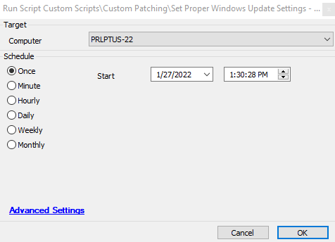

## Summary

Sometimes settings that the Patch Manager is supposed to set via policy don't actually get applied, which can cause issues with patching on some machines. This script will check all of the necessary settings, validate that they are correct, and if they are not, it will set the Windows Update registry keys to their correct values. If needed, it will also restart the Windows Update services and set them to auto-start. This script only includes steps that will run on Windows 10, 11, Server 2016, 2019, and 2022. Any other operating system will complete the script instantly without making any changes.

**File Path:** `C:/ProgramData/_Automation/script/Validate-WUASetting/Validate-WUASetting.ps1`  
**File Hash (Sha256):** `6D629DB410C331B41CA11AE68099AC53A366EA1F7A2EA9D1F44907E8F78FCF38`  
**File Hash (MD5):** `A54248A8166D4815ADD0568A895795F6`

## Additional Context

This script can also serve as a pre-patching tool. When using this script in that context, do not mark the `Fail patch job if script fails or times out` checkbox.

## Sample Run

## Global Variables

If you modify the Active Hours from their default, keep in mind that the **Max** window allowed by Windows is 18 hours.

| Name                   | Description                                                                                                                                                           |
|------------------------|-----------------------------------------------------------------------------------------------------------------------------------------------------------------------|
| BranchLvl              | This indicates what service level branch the machine should be set to. This should not be anything other than 16 unless you want Windows 10 preview builds to be deployed to that machine. [Default: 16] |
| FeatureUpdateDeferral  | How many days you want Feature updates to be not visible to Windows Updates or CWA. [Default: 365]                                                                |
| QualityUpdateDeferral  | How many days you want Quality updates to be not visible to Windows Updates or CWA. [Default: 0]                                                                  |
| ActiveHoursStart       | What time of the day you want the machine's active hours to start, in military time. [Default: 5]                                                                  |
| ActiveHoursEnd         | What time of the day you want the machine's active hours to end, in military time. [Default: 23]                                                                   |

## Script States

| Name                | Example      | Description                                                                                                                                                       |
|---------------------|--------------|-------------------------------------------------------------------------------------------------------------------------------------------------------------------|
| PatchSettingCheck    | Good/Failed  | This state is set when the script runs. If there are any errors reported when attempting to make the necessary changes, it will report as Failed.                 |

## Output

All output for the PowerShell script results is directed to the Script Log and to the Script State 'PatchSettingCheck'.

