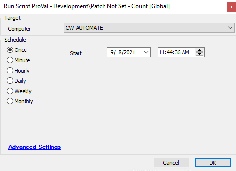

## Summary

This script counts the number of patches that have not been actioned in any approval policy within the client environment.

**Time Saved by Automation:** 10 Minutes

## Sample Run

#### Global Parameters

| Name      | Example | Required | Description                                                                                      |
|-----------|---------|----------|--------------------------------------------------------------------------------------------------|
| Threshold | 10      | True     | This sets the limit to check for not set patches over which a ticket will be created.          |

## Process

This script runs a SQL query to check for the count of patches that have not been actioned via any approval policy and are left as Not Set.

## Output

- Script log

