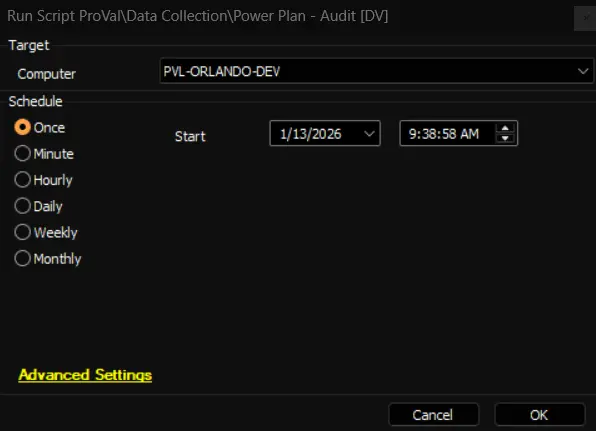

## Summary

This is an Automate implementation of the agnostic script [EPM - Data Collection - Agnostic - Get-PowerPlan](/docs/4d7993ab-1fa8-4b96-9f19-f503737ea015) to gather data and store it in the [EPM - Data Collection - Custom Table - pvl_powerplan_audit](/docs/9560f2db-f58f-4c07-a9da-2828deabc4cf) custom table. The data collected is subsequently displayed using the [EPM - Data Collection - Dataview - Power Plan - Audit [Script]](/docs/3c11e893-b78e-4dc9-a8c2-c80060da203b) dataview.

**File Path:** `C:/ProgramData/_Automation/script/Get-PowerPlan/Get-PowerPlan.ps1`  
**File Hash (Sha256):** `DDE3ACC4A91AB8C7E8971A673AC07B8F4B3B34FA8DAD5849E156C5E6A80DFDF8`  
**File Hash (MD5):** `AE0FAF82228693C611F4578564FE353C`  

**File Path:** `C:/ProgramData/_Automation/script/Get-PowerPlan/Get-PowerPlanAI.ps1`  
**File Hash (Sha256):** `C7CD78CEAC21FF393A913B266CB5C0EC12CEA8E364FA0AD346C287C272463992`  
**File Hash (MD5):** `3AFF43D2532BA4AA1D6DB604F613C8EE`  

## Sample Run

## Dependencies

- [EPM - Data Collection - Agnostic - Get-PowerPlan](/docs/4d7993ab-1fa8-4b96-9f19-f503737ea015)  
- [EPM - Data Collection - Internal Monitor - Execute Script - Power Plan - Audit](/docs/fdbe1912-b216-4876-b64b-db83eee691a1)  
- [CWM - Automate - Script - OverFlowedVariable - SQL Insert - Execute](/docs/34cee8fe-1b6b-4558-a890-2face427ceb8)  

## Variables

| Name               | Description                          |
|--------------------|--------------------------------------|
| TableName          | pvl_powerplan_audit                 |
| ProjectName        | Get-PowerPlan                       |
| WorkingDirectory    | C:/ProgramData/_automation/script/Get-PowerPlan |
| JsonFileName       | Get-PowerPlan.json                  |

## Output

- Script Log
- Custom Table
- Dataview

