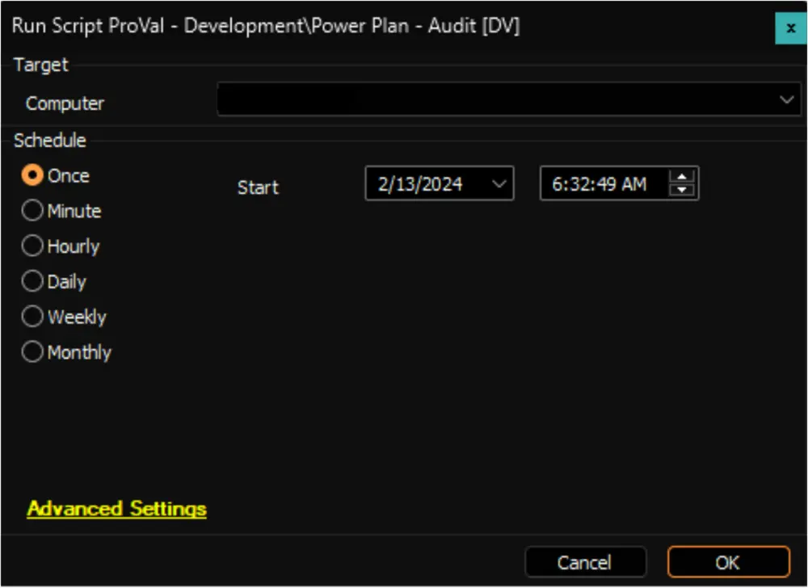

## Summary

This is an Automate implementation of the agnostic script [Get-PowerPlan](/docs/4d7993ab-1fa8-4b96-9f19-f503737ea015) to gather data and store it in the [pvl_powerplan_audit](/docs/9560f2db-f58f-4c07-a9da-2828deabc4cf) custom table. The data collected is subsequently displayed using the [Power Plan - Audit [Script]](/docs/3c11e893-b78e-4dc9-a8c2-c80060da203b) dataview.

**File Path:** `C:/ProgramData/_Automation/script/Get-PowerPlan/Get-PowerPlan.ps1`  
**File Hash (Sha256):** `DDE3ACC4A91AB8C7E8971A673AC07B8F4B3B34FA8DAD5849E156C5E6A80DFDF8`  
**File Hash (MD5):** `AE0FAF82228693C611F4578564FE353C`  

**File Path:** `C:/ProgramData/_Automation/script/Get-PowerPlan/Get-PowerPlanAI.ps1`  
**File Hash (Sha256):** `5A30EF83D46EB05CA6EA9202810237E345C6DDBD56FFB407D3581E7D50C25BD0`  
**File Hash (MD5):** `0D737FC67F3A41B222038A284C5DAD5D`  

## Sample Run

## Dependencies

- [Script - Get-PowerPlan](/docs/4d7993ab-1fa8-4b96-9f19-f503737ea015)  
- [Internal Monitor - Execute Script - Power Plan - Audit](/docs/fdbe1912-b216-4876-b64b-db83eee691a1)  
- [Script - OverFlowedVariable - SQL Insert - Execute](/docs/34cee8fe-1b6b-4558-a890-2face427ceb8)  
- [Solution - Power Plan Management](/docs/e7911ff5-d709-4ba0-b847-16969445c19b/)

## Global Variables

| Name | Value | Accepted Values | Description |
| ---- | ----- | --------------- | ----------- |
| Debug | `False` | `False`, `True` | When `True`, enables informational logging; when `False` (default), informational logs are suppressed to avoid adding entries to the `h_scripts` table. Set to `True` to assist with troubleshooting. |
| ScriptEngineEnableLogger | `False` | `False`, `True` | When `True`, enables final (success/failure) logging; when `False` (default), these logs are suppressed to avoid adding entries to the `h_scripts` table. Set to `True` to assist with troubleshooting. |

## Variables

| Name               | Description                          |
|--------------------|--------------------------------------|
| TableName          | pvl_powerplan_audit                 |
| ProjectName        | Get-PowerPlan                       |
| WorkingDirectory    | C:\ProgramData\_automation\script\Get-PowerPlan |
| JsonFileName       | Get-PowerPlan.json                  |

## Output

- Script Log
- Custom Table
- Dataview
