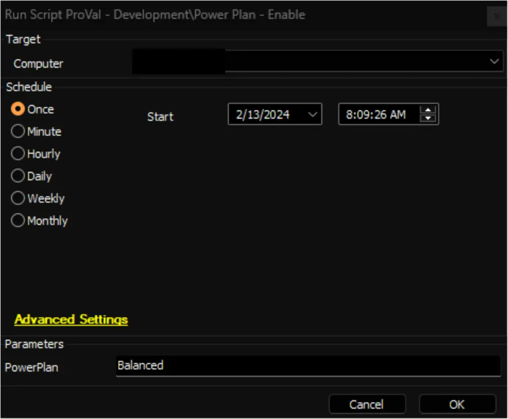

## Summary

This script is an Automate implementation of the agnostic script [Agnostic - Enable-PowerPlan](/docs/a8da2d1c-395e-49ce-b612-75acc9176f3b), which can be utilized to mark an existing Power Plan as active.

- File Path: `C:/ProgramData/_Automation/script/Enable-PowerPlan/Enable-PowerPlan.ps1`  
- File Hash (Sha256): `13F38A3CB96BE9C19B38ED09A1175852B33713DE43368B84867A7999D202F6F3`  
- File Hash (MD5): `59BB9E9FB16FD5E53EB657D0F02ED9A8`  

## Sample Run

**Note:**
- Ensure that the name of the `PowerPlan` matches exactly with the `Power Plan` column in the [Power Plan - Audit [Script]](/docs/3c11e893-b78e-4dc9-a8c2-c80060da203b) dataview.
- After executing the script, changes made at the endpoint can be validated by checking the `Is Active` column for the respective Power Plan in the [Power Plan - Audit [Script]](/docs/3c11e893-b78e-4dc9-a8c2-c80060da203b) dataview. This column indicates whether the Power Plan has been successfully marked as active/enabled.

## Dependencies

- [Agnostic - Remove-PowerPlan](/docs/ffac4670-f9ec-4896-8338-78c92669ee53)
- [Script - Power Plan - Audit [DV]](/docs/6e9ec56b-ba57-48cd-8dff-e659c30d2f3d)
- [Dataview - Power Plan - Audit [Script]](/docs/3c11e893-b78e-4dc9-a8c2-c80060da203b)
- [Solution - Power Plan Management](/docs/e7911ff5-d709-4ba0-b847-16969445c19b/)

## Variables

| Name              | Description                                   |
|-------------------|-----------------------------------------------|
| ProjectName       | Enable-PowerPlan                             |
| WorkingDirectory   | C:/ProgramData/_Automation/Script/Enable-PowerPlan |

## User Parameters

| Name        | Example   | Required | Description                             |
|-------------|-----------|----------|-----------------------------------------|
| PowerPlan   | Balanced  | True     | Name of the Power Plan to enable/activate |

## Output

- Script Log
- Dataview