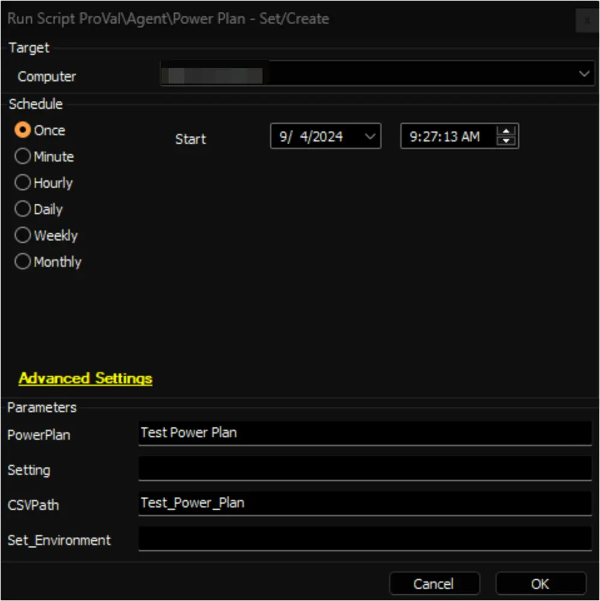

## Summary

This document outlines the Automate implementation of the agnostic script [Set-PowerPlan](/docs/05737947-e8d5-4711-a1d7-91a6db43358f), which can be used to modify or create a power plan.

The settings for the power plan are required to create or modify the power plan. These settings can be provided to the script in two ways: through the `Settings` parameter as a hash table or from a CSV file. A template for the CSV file is attached to this document. Details regarding the columns of the CSV file are explained later in this document.

## Sample Run (Set Environment)

Run the script with the `Set_Environment` parameter set to `1` to create the EDFs used by the script and the [PowerPlan Automation](/docs/625fc28a-23a7-4cb7-beeb-ad5b659af2ab) internal monitor.


## Sample Run (Manual)

**Example 1:** Saving the CSV file for the Power Settings in the LTShare (WebDav for the hosted partners)

- This is the recommended method for running this script.  
- Download the attached [PowerPlanSettingsTemplate.CSV](<../../../static/attachments/itg/14903184/PowerPlanSettingsTemplate.csv>) file from this document.  
- Edit the downloaded file.  
- Specify the necessary values for the power settings in the `Direct Power Settings (AC)` and `Battery Power Settings (DC)` columns.  
- For rows where the `Minimum Possible Setting` and `Maximum Possible Setting` columns have values, ensure that the values in the `Direct Power Settings (AC)` and `Battery Power Settings (DC)` columns fall within the specified range.  
- For rows where the `Possible Settings` column has a value, input the numerical value for both `Direct Power Settings (AC)` and `Battery Power Settings (DC)` columns, as described in the `Possible Settings` column.  
- Refrain from modifying any columns other than the `Direct Power Setting (AC)` and `Direct Power Setting (DC)` columns.  
- Keep the first row of the CSV file unchanged.


- Rename the file to a name relevant to the PowerProfile you intend to create or edit.  
- In this example, I am renaming it to `Test_Power_Plan` as I will be creating a power plan named `Test Power Plan` on the machine.  
- Place the file in the `LTShare` (WebDav for hosted partners) within the `Transfer/PowerPlan` directory. If the `PowerPlan` directory doesn't exist under the `Transfer` directory, you may need to create it.


- Alternatively, you can use the [ProVal_-_High_Performance.csv](<../../../static/attachments/itg/15053772/ProVal_-_High_Performance.csv>) file. It's a pre-created power profile equivalent to the Windows default `High Performance`.  
- Run the script on the relevant machine(s) with the specified parameters to create the `Test Power Plan` with the power settings outlined in the CSV file `Test_Power_Plan`:

**PowerPlan:** Test Power Plan  
**CSVPath:** Test_Power_Plan  



**Example 2:** Placing the CSV file in a downloadable location other than LTShare.

- This method can be used if the CSV file cannot be placed in the LTShare but can be placed at another downloadable location.  
- Edit and rename the CSV file as explained in **Example 1**.  
- Place the file at a location from where it can be downloaded using a download URL.  
- I have placed the file at [https://file.provaltech.com](https://file.provaltech.com), and the download URL is [https://file.provaltech.com/repo/powerplan/Test_Power_Plan.csv](https://file.provaltech.com/repo/powerplan/Test_Power_Plan.csv). (This is a dummy download URL used in this example to demonstrate how a download URL to download the CSV file should look.)  
- Run the script on the relevant machine(s) with the specified parameters to create the `Test Power Plan` with the power settings outlined in the CSV file `Test_Power_Plan`:

**PowerPlan:** Test Power Plan  
**CSVPath:** [https://file.provaltech.com/repo/powerplan/Test_Power_Plan.csv](https://file.provaltech.com/repo/powerplan/Test_Power_Plan.csv)  


**Example 3:** Using HashTable

- This approach is suitable for updating a selected number of settings within a power plan.  
- Proficiency in PowerShell's hash table is crucial to utilize this method effectively.  
- In this method, the power settings are supplied to the script through the `Settings` parameter, employing a correctly formatted hash table of the settings.

**Format of the Hash Table:**

```powershell
@{Subgroup=@{'<Name of the Subgroup>' = @{ <strong>PowerSetting </strong>= @{ '<Name of the Power Setting>' = @{ AC = <Value of the setting on Direct Power>; DC = <Value of the Setting on Battery Power> }; 'Name of the Power Setting' = @{ AC = <Value of the setting on Direct Power>; DC = <Value of the Setting on Battery Power>}; '<Name of the Power Setting>' = @{ AC = <Value of the setting on Direct Power>; DC = <Value of the Setting on Battery Power>}; '<Name of the Power Setting>' = @{ AC = <Value of the setting on Direct Power>; DC = <Value of the Setting on Battery Power> }}}}}
```

Ensure that the name of the subgroup and the power settings match those specified in the attached CSV file. The values for both AC and DC should fall within the range defined in the CSV file or be selected from the possible settings if the range does not apply to the setting.

In this example, I am configuring the values for the following settings within the `Test Power Plan`:

```powershell
@{Subgroup=@{'Sleep' = @{ PowerSetting = @{ 'Sleep after' = @{ AC = 60; DC = 60 }; 'Allow hybrid sleep' = @{ AC = 1; DC = 100}; 'Hibernate After' = @{ AC = 0; DC = 18000}; 'Allow Wake Timers' = @{ AC = 2; DC = 2 }}}}}
```

If the power plan named `Test Power Plan` doesn't already exist on the computer, the script will create it with the settings outlined in the table below while the rest of the settings will be copied from the currently active power plan. Otherwise, if the plan already exists, only the following settings will be modified.

| Subgroup | Power Setting          | Direct Power Settings (AC) | Battery Power Settings (DC) |
|----------|------------------------|-----------------------------|------------------------------|
| Sleep    | Sleep after            | 60                          | 60                           |
| Sleep    | Allow hybrid sleep     | 1                           | 100                          |
| Sleep    | Hibernate After        | 0                           | 18000                        |
| Sleep    | Allow Wake Timers      | 2                           | 2                            |

Run the script on the relevant machine(s) with the specified parameters to create/modify the `Test Power Plan` with the power settings outlined in the `Setting` parameter:

**PowerPlan:** Test Power Plan  
**Setting:**

```powershell
@{Subgroup=@{'Sleep' = @{ PowerSetting = @{ 'Sleep after' = @{ AC = 60; DC = 60 }; 'Allow hybrid sleep' = @{ AC = 1; DC = 100}; 'Hibernate After' = @{ AC = 0; DC = 18000}; 'Allow Wake Timers' = @{ AC = 2; DC = 2 }}}}}
```


*See the [agnostic script's](/docs/05737947-e8d5-4711-a1d7-91a6db43358f) documentation for additional examples.*

## Automation

- Edit and place the [configuration file](<../../../static/attachments/itg/14903184/PowerPlanSettingsTemplate.csv>) in the `LTShare (WebDav for hosted partners)` within the `Transfer/PowerPlan` directory as described in **Example 1** of the `Sample Run (Manual)` section. Alternatively, you can use the [ProVal_-_High_Performance.csv](<../../../static/attachments/itg/15053772/ProVal_-_High_Performance.csv>) file. It's a pre-created power profile equivalent to the Windows default `High Performance`.


- Set the appropriate option in the Client-Level EDF `PowerPlan Automation` to enable it for the client's machines. Leaving it blank is equivalent to setting it to `Not Enabled`.


- Set the name of the CSV file placed in the LTShare to the `PowerPlan Configuration File` EDF.


- Set the name of the PowerPlan to the `PowerPlan Name` EDF. This name will be displayed for the plan at the end machine and can be anything.


**Note:**

- In the example demonstrated above, the `ProVal High Performance` power plan will be set and enabled on all workstations of the `Development` client.
- The [PowerPlan Automation](/docs/625fc28a-23a7-4cb7-beeb-ad5b659af2ab) internal monitor should be running for the automation to work.

## PowerPlanSettingsTemplate.CSV

The provided CSV file acts as the template for the settings accepted by the script for creating or modifying the power plan. To use it effectively, download and modify the template to specify the CSVPath parameter, as illustrated in the aforementioned examples.

Here's a breakdown of the columns in the CSV file:

**Subgroup:** Displays the name of the subgroups of the power plan. This column should not be edited or modified.

**Power Setting:** Indicates the name of the associated power setting for that subgroup. This column should not be edited or modified.

**Direct Power Settings (AC):** Stores the value for the power setting when the machine is connected directly to electricity. Update this column as required.

**Battery Power Setting (DC):** Stores the value for the power setting when the machine is running on battery/UPS power. Update this column as required.

**Minimum Possible Setting:** Specifies the minimum value that can be set for the `Direct Power Settings (AC)` and `Battery Power Settings (DC)` columns. Applicable for rows where a value is present in this column. Do not edit or modify this column.

**Maximum Possible Setting:** Defines the maximum value that can be set for the `Direct Power Settings (AC)` and `Battery Power Settings (DC)` columns. Applicable for rows where a value is present in this column. Do not edit or modify this column.

**Possible Settings:** Explains the values that can be set for the `Direct Power Settings (AC)` and `Battery Power Settings (DC)` columns. Applicable for rows where a value is present in this column. Do not edit or modify this column.

**Additional Notes:** Offers additional explanations, particularly when 0 signifies `never` for rows where such interpretation is relevant.

**Note:** To understand the relation of the columns in the CSV file with the power plan settings, you can run the `powercfg /query` command from the command prompt. This command will display detailed information about the power plans configured on your Windows computer, including their settings. By examining the output of this command, you can correlate the settings listed with the columns in the CSV file, such as subgroup names, power setting names, and their corresponding values for AC and DC power sources.

## Dependencies

- [Power Plan - Audit [DV]](/docs/6e9ec56b-ba57-48cd-8dff-e659c30d2f3d)
- [Set-PowerPlan](/docs/05737947-e8d5-4711-a1d7-91a6db43358f)
- [OverFlowedVariable - SQL Insert - Execute](/docs/34cee8fe-1b6b-4558-a890-2face427ceb8)
- [Solution - Power Plan Management](/docs/e7911ff5-d709-4ba0-b847-16969445c19b/)

## Variables

| Name              | Description                                |
|-------------------|--------------------------------------------|
| ProjectName       | Set-PowerPlan                              |
| WorkingDirectory   | `C:/ProgramData/_Automation/Script/Set-PowerPlan` |

### User Parameters

| Name              | Example                                                                 | Required        | Description                                              |
|-------------------|-------------------------------------------------------------------------|------------------|----------------------------------------------------------|
| PowerPlan         | Test Power Plan                                                          | True             | Name of the power plan to modify or create.             |
| Setting           | @\{Subgroup=@\{'Sleep' = @\{ PowerSetting = @\{ 'Sleep after' = @\{ AC = 60; DC = 60 }; 'Allow hybrid sleep' = @\{ AC = 1; DC = 100}; 'Hibernate After' = @\{ AC = 0; DC = 18000}; 'Allow Wake Timers' = @\{ AC = 2; DC = 2 }}}}} | Partially        | Hash table of the power plan settings to set.           |
| CSVPath           | [https://file.provaltech.com/repo/powerplan/Test_Power_Plan.csv](https://file.provaltech.com/repo/powerplan/Test_Power_Plan.csv) (if the CSV file of the settings is placed at a downloadable location) OR Test_Power_Plan (if the CSV file of the settings is placed in the LTShare (WebDav for the hosted partners) under the `Transfer/PowerPlan` directory) | Partially        | Download URL of the CSV file if the file is placed at a downloadable location. OR Name of the CSV file if the file is placed in the LTShare (WebDav for the hosted partners) under the `Transfer/PowerPlan` directory. |
| Set_Environment    | 1                                                                       | For the first run | Run the script with the `Set_Environment` parameter set to `1` to create the EDFs used by the script and the [PowerPlan Automation](/docs/625fc28a-23a7-4cb7-beeb-ad5b659af2ab) internal monitor. |

## Client-Level EDF

| Name                       | Example | Type      | Section    | Description                                                                                      |
|----------------------------|---------|-----------|------------|--------------------------------------------------------------------------------------------------|
| PowerPlan Automation        | 1/0     | Dropdown  | PowerPlan  | Set the appropriate option in Client-Level EDF `PowerPlan Automation` to enable it for the client's machines. Available Options: <ul><li>Not Enabled</li><li>Enabled for Workstations Only</li><li>Enabled for Laptops Only</li><li>Enabled for Servers Only</li><li>Enabled for All Machines</li></ul> |
| PowerPlan Configuration File| ProVal_-_High_Performance | Text      | PowerPlan  | Set the name of the CSV file placed in the LTShare to the `PowerPlan Configuration File` EDF. |
| PowerPlan Name             | ProVal High Performance | Text      | PowerPlan  | Set the name of the PowerPlan to the `PowerPlan Name` EDF. This name will be displayed for the plan at the end machine and can be anything. |


## Computer-Level EDF

| Name                           | Example | Type       | Section    | Description                                                                                      |
|--------------------------------|---------|------------|------------|--------------------------------------------------------------------------------------------------|
| PowerPlan Automation Exclusion  | 1/0     | Check Box  | Exclusions | Mark this EDF to exclude the computer from the PowerPlan automation.                            |

## Output

- Script Log
- Custom Table

## Attachments

[PowerPlanSettingsTemplate.csv](<../../../static/attachments/itg/14903184/PowerPlanSettingsTemplate.csv>)  
[ProVal_-_High_Performance.csv](<../../../static/attachments/itg/15053772/ProVal_-_High_Performance.csv>)
