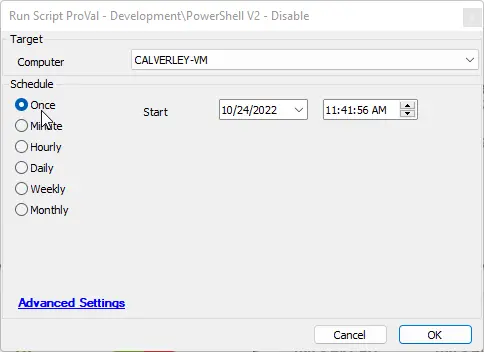

## Summary

This document provides an implementation guide for the Disable-PowershellVersion2 agnostic script.

## Sample Run

## Dependencies

- [EPM - Windows Configuration - Agnostic - Disable-PowershellVersion2](/docs/1691cc51-ef36-451d-9086-ca69c6ef85d8)

## Process

Please review the agnostic content document for the complete process.
