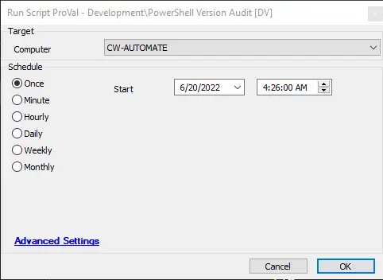

## Summary

This script obtains the current agent PowerShell version. The script is supported in all versions of PowerShell to collect its version.

## Sample Run

## Dependencies

[PowerShell Version Audit](/docs/388b4b61-34b7-4d40-b4de-507032df83d7)

## Variables

| Name   | Description                     |
|--------|---------------------------------|
| psout  | This contains the PowerShell Version |

#### Script States

| Name               | Example    | Description                     |
|--------------------|------------|---------------------------------|
| PowerShellVersion   | 2022.5.1   | This contains the PowerShell Version |

## Process

This script runs a PowerShell query that is supported by all Windows operating systems and collects the data to the Script State, which replicates to the dataview. It also stores the date when the PowerShell version was last checked.

## Output

- Script log
- Script state
- Dataview