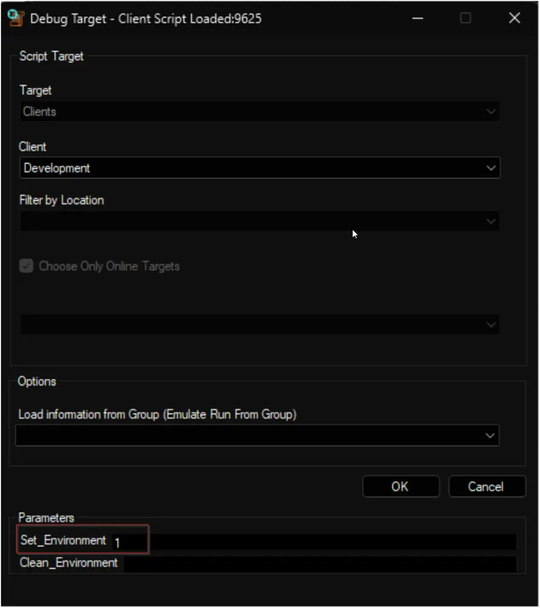
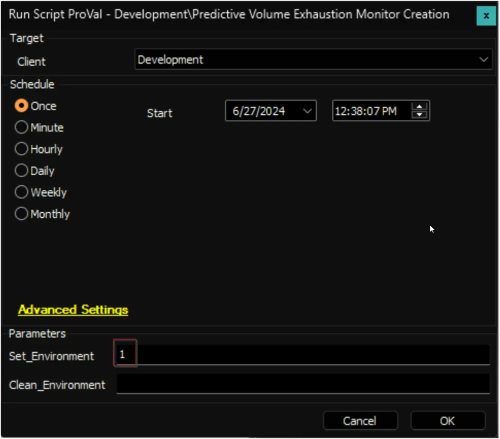
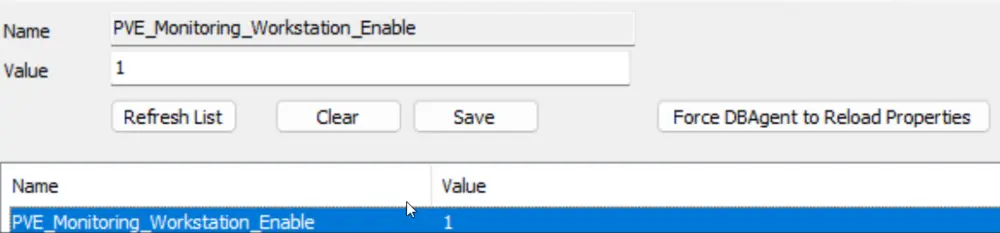

## Summary

The script is designed to set up the [Volume Space Prediction](/docs/e928f9f6-f97d-44f3-aad2-26186416fa1f) Remote Monitor for Windows machines. [Volume Space Sampling](/docs/3a441306-efbc-48a5-8732-06bfd56c9a5f) monitors will be created when the `Auditing` feature is active.

The remote monitors are compatible with the following operating systems:
- Windows 10
- Windows 11
- Windows Server 2016
- Windows Server 2019
- Windows Server 2022

The implementation of these remote monitors is controlled by system properties and Extra Data Fields (EDFs). The specifics of these configurations are elaborated on in this document.

## Sample Run

**First Run:**  
Run/Debug the script against any random client with the `Set_Environment` parameter set to `1` to create the system properties and the extra data fields used by the script. It will also remove the deprecated version of the solution from the environment.  
  
  

**Script Schedule:**  
It is a client script and is suggested to schedule it to run once per day for best results.  
  

## Dependencies

[EPM - Disk - Agnostic - Get-VolumeExhaustionEstimate](/docs/21bc13d3-b2fb-42d5-8f38-da9b43990e06)

## Remote Monitors

- [EPM - Disk - Remote Monitor - Volume Space Prediction](/docs/e928f9f6-f97d-44f3-aad2-26186416fa1f)
- [EPM - Disk - Remote Monitor - Volume Space Sampling](/docs/3a441306-efbc-48a5-8732-06bfd56c9a5f)

## User Parameters

| Name                          | Example | Required                     | Description                                                                                                                                                                                                                     |
|-------------------------------|---------|------------------------------|---------------------------------------------------------------------------------------------------------------------------------------------------------------------------------------------------------------------------------|
| Set_Environment               | 1       | True (for first run only)   | Set it to 1 during the first run of the script to generate the necessary system properties and EDFs for managing the generated remote monitors. It will also remove the deprecated version of the solution from the environment. |
| Clean_Environment             | 0       | False                        | This is a potentially destructive option. Setting this parameter to 1 while running the script will remove all the remote monitors, system properties, and EDFs generated by the script. **USE WITH CAUTION**                    |

## System Properties

| Name                                 | Example | Default | Required | Description                                                                                                                                                                                                                                                                                                                                                                                                                                                                                                                |
|--------------------------------------|---------|---------|----------|----------------------------------------------------------------------------------------------------------------------------------------------------------------------------------------------------------------------------------------------------------------------------------------------------------------------------------------------------------------------------------------------------------------------------------------------------------------------------------------------------------------------------|
| PVE_Monitoring_Server_Enable         | 1       | 1       | True     | Set it to `1` to enable the [Volume Space Prediction](/docs/e928f9f6-f97d-44f3-aad2-26186416fa1f) monitor creation for the servers.                                                                                                                                                                                                                                                                                                                                                                       |
| PVE_Monitoring_Workstation_Enable    | 1       | 1       | True     | Set it to `1` to enable the [Volume Space Prediction](/docs/e928f9f6-f97d-44f3-aad2-26186416fa1f) monitor creation for the workstations.                                                                                                                                                                                                                                                                                                                                                                       |
| PVE_Monitoring_Server_AuditOnly      | 1       | 1       | False    | Set it to `1` to create the [Volume Space Sampling](/docs/3a441306-efbc-48a5-8732-06bfd56c9a5f) monitor instead of [Volume Space Prediction](/docs/e928f9f6-f97d-44f3-aad2-26186416fa1f) for the servers. The existing [Volume Space Prediction](/docs/e928f9f6-f97d-44f3-aad2-26186416fa1f) monitors will be removed from the servers.                                                                                                            |
| PVE_Monitoring_Workstation_AuditOnly | 1       | 1       | False    | Set it to `1` to create the [Volume Space Sampling](/docs/3a441306-efbc-48a5-8732-06bfd56c9a5f) monitor instead of [Volume Space Prediction](/docs/e928f9f6-f97d-44f3-aad2-26186416fa1f) for the workstations. The existing [Volume Space Prediction](/docs/e928f9f6-f97d-44f3-aad2-26186416fa1f) monitors will be removed from the workstations.                                                                                                            |
| PVE_Monitoring_Interval              | 7200    | 3600    | True     | Controls the generated Remote Monitor run time interval.                                                                                                                                                                                                                                                                                                                                                          |
| PVE_Monitoring_MinSizeGB             | 64      | 16      | True     | The minimum drive size, in GigaBytes (GB), required to create a remote monitor is specified by this property. The default value is set at 16 GB. This means that the script will not create a remote monitor for any drive smaller than 16 GB.                                                                                                                                                                                                                                                                |
| PVE_Monitoring_Server_C_DriveOnly    | 1       | 0       | False    | If this property is set to 1, for the servers; the script will create remote monitors for the C: Drive only. By default, this property is set to 0, which means the remote monitor will be created for all internal/fixed drives.                                                                                                                                                                                                                                            |
| PVE_Monitoring_Workstation_C_DriveOnly| 1       | 0       | False    | If this property is set to 1, for the workstations; the script will create remote monitors for the C: Drive only. By default, this property is set to 0, which means the remote monitor will be created for all internal/fixed drives.                                                                                                                                                                                                                                            |
| PVE_Monitoring_Server_ExcludedDrives | DEF     |         | False    | This system property allows excluding specific drive letters for the servers from the monitor creation. The script will not create any remote monitors for the drives corresponding to the letters stored in this property. Furthermore, it will remove any existing monitors for these excluded drives, if any were previously created. For example, if you set this system property to `EFGH`, the script will exclude the `E`, `F`, `G`, and `H` drives of the servers from monitoring.  |
| PVE_Monitoring_Workstation_ExcludedDrives | EF  |         | False    | This system property allows excluding specific drive letters for the workstations from the monitor creation. The script will not create any remote monitors for the drives corresponding to the letters stored in this property. Furthermore, it will remove any existing monitors for these excluded drives, if any were previously created. For example, if you set this system property to `EFGH`, the script will exclude the `E`, `F`, `G`, and `H` drives of the workstations from monitoring.  |
| PVE_Monitoring_Server_MinSamples     | 60      | 30      | True     | The minimum number of samples required to generate an estimation for the servers. If a volume does not meet this number of samples, the estimation will be skipped.                                                                                                                                                                                                                                                                                                                                                           |
| PVE_Monitoring_Workstation_MinSamples | 45      | 30      | True     | The minimum number of samples required to generate an estimation for the workstations. If a volume does not meet this number of samples, the estimation will be skipped.                                                                                                                                                                                                                                                                                                                                                           |
| PVE_Monitoring_Server_DaysToReport   | 30      | 14      | True     | The maximum age of samples to use for generating an estimation for the servers.                                                                                                                                                                                                                                                                                                                                                                                                                                                      |
| PVE_Monitoring_Workstation_DaysToReport | 21    | 14      | True     | The maximum age of samples to use for generating an estimation for the workstations.                                                                                                                                                                                                                                                                                                                                                                                                                                                |
| PVE_Monitoring_Server_DaysToLead     | 14      | 7       | True     | The number of days before volume exhaustion to generate a volume space estimation for the servers.                                                                                                                                                                                                                                                                                                                                                                                                                                       |
| PVE_Monitoring_Workstation_DaysToLead | 7       | 7       | True     | The number of days before volume exhaustion to generate a volume space estimation for the workstations.                                                                                                                                                                                                                                                                                                                                                                                                                                       |
| PVE_Monitoring_Server_AlertTemplate   | 3       | 3       | True     | ID of the alert template to apply to the remote monitors created for the servers.   To find the ID of the Alert Templates:  **Note**: Not applicable for [Volume Space Sampling](/docs/3a441306-efbc-48a5-8732-06bfd56c9a5f) monitors or with `PVE_Monitoring_Server_AuditOnly` property. |
| PVE_Monitoring_Workstation_AlertTemplate | 1   | 3       | True     | ID of the alert template to apply to the remote monitors created for the workstations.  **Note**: Not applicable for [Volume Space Sampling](/docs/3a441306-efbc-48a5-8732-06bfd56c9a5f) monitors or with `PVE_Monitoring_Workstation_AuditOnly` property.                                                                                                                                                                                                                                                 |
| PVE_Monitoring_Server_TicketCategory  | 102     | 102     | False    | ID of the ticket category to apply to the remote monitors created for the servers.   To find the ID of the Ticket Categories:  **Note**: Not applicable for [Volume Space Sampling](/docs/3a441306-efbc-48a5-8732-06bfd56c9a5f) monitors or with `PVE_Monitoring_Server_AuditOnly` property. |
| PVE_Monitoring_Workstation_TicketCategory | 102 | 102     | False    | ID of the ticket category to apply to the remote monitors created for the workstations.  **Note**: Not applicable for [Volume Space Sampling](/docs/3a441306-efbc-48a5-8732-06bfd56c9a5f) monitors or with `PVE_Monitoring_Workstation_AuditOnly` property.                                                                                                                                                                                                                                    |

## Client-Level EDFs

| Name                       | Example | Type     | Description                                                                                                                                                                                                                                                                                                                                                                                                                                                                                                                |
|----------------------------|---------|----------|----------------------------------------------------------------------------------------------------------------------------------------------------------------------------------------------------------------------------------------------------------------------------------------------------------------------------------------------------------------------------------------------------------------------------------------------------------------------------------------------------------------------------|
| PVEM_Exclude               | 1/0     | Check Box| Selecting this Extra Data Field (EDF) will exclude the entire client from the monitoring. As a result, the script will not create any remote monitors for the machines under this client. Furthermore, upon marking this EDF, the script will also remove any previously created remote monitors for this client. This allows for flexible and customizable monitoring based on individual client needs.                                                                  |
| PVEM_Exclude_Svr          | 1/0     | Check Box| Selecting this Extra Data Field (EDF) will exclude the servers of this client from the monitoring. As a result, the script will not create any remote monitors for the servers under this client. Furthermore, upon marking this EDF, the script will also remove any previously created remote monitors for the servers of this client.                                                                                                          |
| PVEM_Exclude_Wks          | 1/0     | Check Box| Selecting this Extra Data Field (EDF) will exclude the workstations of this client from the monitoring. As a result, the script will not create any remote monitors for the workstations under this client. Furthermore, upon marking this EDF, the script will also remove any previously created remote monitors for the workstations of this client.                                                                                                          |
| PVEM_Svr_AuditOnly        | 1/0     | Check Box| Selecting this EDF will create the [Volume Space Sampling](/docs/3a441306-efbc-48a5-8732-06bfd56c9a5f) monitor instead of [Volume Space Prediction](/docs/e928f9f6-f97d-44f3-aad2-26186416fa1f) for the servers of the client. The existing [Volume Space Prediction](/docs/e928f9f6-f97d-44f3-aad2-26186416fa1f) monitors will be removed from the servers.                                                                                      |
| PVEM_Wks_AuditOnly        | 1/0     | Check Box| Selecting this EDF will create the [Volume Space Sampling](/docs/3a441306-efbc-48a5-8732-06bfd56c9a5f) monitor instead of [Volume Space Prediction](/docs/e928f9f6-f97d-44f3-aad2-26186416fa1f) for the workstations of the client. The existing [Volume Space Prediction](/docs/e928f9f6-f97d-44f3-aad2-26186416fa1f) monitors will be removed from the workstations.                                                                                      |
| PVEM_Svr_C_DriveOnly      | 1/0     | Check Box| If this EDF is marked, the script will create remote monitors for the C: Drive only for the servers of the client.                                                                                                                                                                                                                                                                                                                                                                            |
| PVEM_Wks_C_DriveOnly      | 1/0     | Check Box| If this EDF is marked, the script will create remote monitors for the C: Drive only for the workstations of the client.                                                                                                                                                                                                                                                                                                                                                                            |
| PVEM_Svr_ExcludedDrives   | DE      | Text     | This EDF allows excluding specific drive letters for the servers from the monitor creation. The script will not create any remote monitors for the drives corresponding to the letters stored in this EDF. Furthermore, it will remove any existing monitors for these excluded drives, if any were previously created. For example, if you set this system property to `EFGH`, the script will exclude the `E`, `F`, `G`, and `H` drives of the servers from monitoring.  |
| PVEM_Wks_ExcludedDrives   | EFG     | Text     | This EDF allows excluding specific drive letters for the workstations from the monitor creation. The script will not create any remote monitors for the drives corresponding to the letters stored in this EDF. Furthermore, it will remove any existing monitors for these excluded drives, if any were previously created. For example, if you set this system property to `EFGH`, the script will exclude the `E`, `F`, `G`, and `H` drives of the workstations from monitoring.  |
| PVEM_Server_MinSamples     | 30      | Text     | The minimum number of samples required to generate an estimation for the servers. If a volume does not meet this number of samples, the estimation will be skipped.                                                                                                                                                                                                                                          |
| PVEM_Wks_MinSamples        | 20      | Text     | The minimum number of samples required to generate an estimation for the workstations. If a volume does not meet this number of samples, the estimation will be skipped.                                                                                                                                                                                                                                          |
| PVEM_Svr_DaysToReport      | 14      | Text     | The maximum age of samples to use for generating an estimation for the servers of the client. Overrides the value stored in the `PVE_Monitoring_Server_DaysToReport` system property.                                                                                                                                                                                                                                                                                                                                  |
| PVEM_Wks_DaysToReport      | 7       | Text     | The maximum age of samples to use for generating an estimation for the workstations of the client. Overrides the value stored in the `PVE_Monitoring_Workstation_DaysToReport` system property.                                                                                                                                                                                                                                                                                                               |
| PVEM_Svr_DaysToLead        | 14      | Text     | The number of days before volume exhaustion to generate a volume space estimation for the servers of the client. Overrides the value stored in the `PVE_Monitoring_Server_DaysToLead` system property.                                                                                                                                                                                                                                            |
| PVEM_Wks_DaysToLead        | 7       | Text     | The number of days before volume exhaustion to generate a volume space estimation for the workstations of the client. Overrides the value stored in the `PVE_Monitoring_Workstation_DaysToLead` system property.                                                                                                                                                                                                                                            |
| PVEM_Svr_AlertTemplate      | 54      | Text     | ID of the alert template to apply to the remote monitors created for the servers of the client. Overrides the value stored in the `PVE_Monitoring_Server_AlertTemplate` system property.  **Note:** Not applicable for [Volume Space Sampling](/docs/3a441306-efbc-48a5-8732-06bfd56c9a5f) monitors or with the Audit only settings.                                                                                                            |
| PVEM_Wks_AlertTemplate      | 1       | Text     | ID of the alert template to apply to the remote monitors created for the workstations of the client. Overrides the value stored in the `PVE_Monitoring_Workstation_AlertTemplate` system property.  **Note:** Not applicable for [Volume Space Sampling](/docs/3a441306-efbc-48a5-8732-06bfd56c9a5f) monitors or with the Audit only settings.                                                                                                            |
| PVEM_Svr_TicketCategory      | 102     | Text     | ID of the ticket category to apply to the remote monitors created for the servers of the client. Overrides the value stored in the `PVE_Monitoring_Server_TicketCategory` system property.  **Note:** Not applicable for [Volume Space Sampling](/docs/3a441306-efbc-48a5-8732-06bfd56c9a5f) monitors or with the Audit only settings.                                                                                                            |
| PVEM_Wks_TicketCategory      | 102     | Text     | ID of the ticket category to apply to the remote monitors created for the workstations of the client. Overrides the value stored in the `PVE_Monitoring_Workstation_TicketCategory` system property.  **Note:** Not applicable for [Volume Space Sampling](/docs/3a441306-efbc-48a5-8732-06bfd56c9a5f) monitors or with the Audit only settings.                                                                                                            |

## Location-Level EDFs

| Name                       | Example | Type     | Description                                                                                                                                                                                                                                                                                                                                                                                                                                                                                                                |
|----------------------------|---------|----------|----------------------------------------------------------------------------------------------------------------------------------------------------------------------------------------------------------------------------------------------------------------------------------------------------------------------------------------------------------------------------------------------------------------------------------------------------------------------------------------------------------------------------|
| PVEM_Exclude               | 1/0     | Check Box| Selecting this Extra Data Field (EDF) will exclude the entire location from the monitoring. As a result, the script will not create any remote monitors for the machines under this location. Furthermore, upon marking this EDF, the script will also remove any previously created remote monitors for this location.                                                                                                                                                                                                                                    |
| PVEM_Exclude_Svr          | 1/0     | Check Box| Selecting this Extra Data Field (EDF) will exclude the servers of this location from the monitoring. As a result, the script will not create any remote monitors for the servers under this location. Furthermore, upon marking this EDF, the script will also remove any previously created remote monitors for the servers of this location.                                                                                                                                                                                    |
| PVEM_Exclude_Wks          | 1/0     | Check Box| Selecting this Extra Data Field (EDF) will exclude the workstations of this location from the monitoring. As a result, the script will not create any remote monitors for the workstations under this location. Furthermore, upon marking this EDF, the script will also remove any previously created remote monitors for the workstations of this location.                                                                                                                                                                                    |
| PVEM_Svr_AuditOnly        | 1/0     | Check Box| Selecting this EDF will create the [Volume Space Sampling](/docs/3a441306-efbc-48a5-8732-06bfd56c9a5f) monitor instead of [Volume Space Prediction](/docs/e928f9f6-f97d-44f3-aad2-26186416fa1f) for the servers of the location. The existing [Volume Space Prediction](/docs/e928f9f6-f97d-44f3-aad2-26186416fa1f) monitors will be removed from the servers.                                                                                                             |
| PVEM_Wks_AuditOnly        | 1/0     | Check Box| Selecting this EDF will create the [Volume Space Sampling](/docs/3a441306-efbc-48a5-8732-06bfd56c9a5f) monitor instead of [Volume Space Prediction](/docs/e928f9f6-f97d-44f3-aad2-26186416fa1f) for the workstations of the location. The existing [Volume Space Prediction](/docs/e928f9f6-f97d-44f3-aad2-26186416fa1f) monitors will be removed from the workstations.                                                                                                             |

## Computer-Level EDFs

| Name                       | Example | Type     | Description                                                                                                                                                                                                                                                                                                                                                                                                                                                                                                                |
|----------------------------|---------|----------|----------------------------------------------------------------------------------------------------------------------------------------------------------------------------------------------------------------------------------------------------------------------------------------------------------------------------------------------------------------------------------------------------------------------------------------------------------------------------------------------------------------------------|
| PVEM_Exclude               | 1/0     | Check Box| Selecting this Extra Data Field (EDF) will exclude the computer from the monitoring. As a result, the script will not create any remote monitors for the machine. Furthermore, upon marking this EDF, the script will also remove any previously created remote monitors for this computer.                                                                                                                                                                                                                                    |
| PVEM_AuditOnly             | 1/0     | Check Box| Selecting this EDF will create the [Volume Space Sampling](/docs/3a441306-efbc-48a5-8732-06bfd56c9a5f) monitor instead of [Volume Space Prediction](/docs/e928f9f6-f97d-44f3-aad2-26186416fa1f) for the machine. The existing [Volume Space Prediction](/docs/e928f9f6-f97d-44f3-aad2-26186416fa1f) monitors will be removed.                                                                                                                                                                           |
| PVEM_C_DriveOnly          | 1/0     | Check Box| If this EDF is marked, the script will create remote monitors for the C: Drive only for the computer.                                                                                                                                                                                                                                                                                                                                                                            |
| PVEM_ExcludedDrives       | EDF     | Text     | This EDF allows excluding specific drive letters for the computer from the monitor creation. The script will not create any remote monitors for the drives corresponding to the letters stored in this EDF. Furthermore, it will remove any existing monitors for these excluded drives, if any were previously created.                                                                                                                                                             |
| PVEM_MinSamples           | 45      | Text     | The minimum number of samples required to generate an estimation for the computer. If a volume does not meet this number of samples, the estimation will be skipped.                                                                                                                                                                                                                                                                                                                                                                               |
| PVEM_DaysToReport         | 30      | Text     | The maximum age of samples to use for generating an estimation for the servers of the computer.                                                                                                                                                                                                                                                                                                                                                                                     |
| PVEM_DaysToLead           | 10      | Text     | The number of days before volume exhaustion to generate a volume space estimation for the computer.                                                                                                                                                                                                                                                                                                                                                                                     |

## Output

- Remote Monitors
