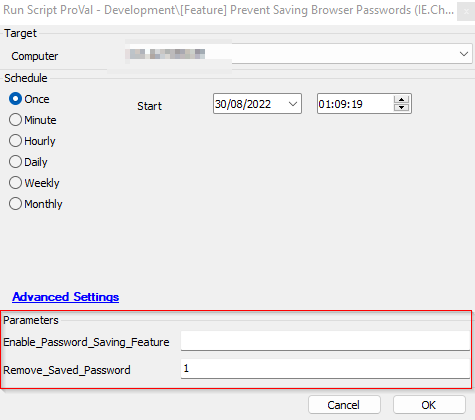

## Summary

This is a new version of the [Prevent Saving Browser Passwords (IE.Chrome.FF)](/docs/5e0e3054-ce35-494b-bdde-c8b0c56305d0) script.

This script currently supports Internet Explorer, Chrome, Firefox, and Edge and will lock those browsers from prompting to save passwords by making changes in the registry.

It provides an option to enable the Password Saving Feature for the concerned browsers as well. All you need to do is set the `@Enable_Password_Saving_Feature@` parameter to 1.

There's an additional feature available to remove/delete the currently saved passwords for these browsers. To activate this feature, set the `@Remove_Saved_Password@` parameter to 1. By default, this option is disabled because the concerned browser must be closed/terminated in order to remove the password.

## Sample Run

In the above screenshot, the Password Saving Feature for the browsers will be disabled for the computer. Additionally, currently saved passwords will be removed, but the concerned browser will also be closed.

## Variables

| Name    | Description                                            |
| ------- | ------------------------------------------------------ |
| OutCome | Output of the PowerShell script performing the action. |

#### User Parameters

| Name                           | Example | Required | Description                                                                                              |
| ------------------------------ | ------- | -------- | -------------------------------------------------------------------------------------------------------- |
| Enable_Password_Saving_Feature | 1       | False    | (empty or anything else) = Disables Password Saving; 1 = Enables Password Saving                         |
| Remove_Saved_Passwords         | 1       | False    | (empty or anything else) = Leaves the currently saved password; 1 = Removes the Currently Saved Password |

#### Script States

| Name                                  | Example                | Description                                                                                                      |
| ------------------------------------- | ---------------------- | ---------------------------------------------------------------------------------------------------------------- |
| Date Disabled Password Saving Feature | 31/08/2022 02:00:00 AM | Last time the Password Saving Feature was disabled for the computer; can be used to create a dataview if needed. |
| Date Enabled Password Saving Feature  | 31/08/2022 02:00:00 AM | Last time the Password Saving Feature was enabled for the computer; can be used to create a dataview if needed.  |

## Process

1. The script checks the parameter to allow/disable the saving of passwords.
2. It executes a PowerShell command to perform the concerned action. Along with disabling the password saving feature, it removes the saved passwords based on the value inputted for the Remove_Saved_Password parameter.
3. It verifies the PowerShell's outcome and logs the result.
4. It saves the current time to the script state.

## Output

- Script Log
- Script State

