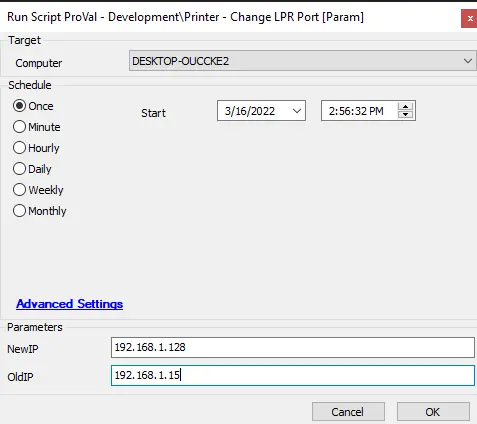

## Summary

This document describes how to change the printer's IP address from `@OldIP@` to `@NewIP@`.

**Time Saved by Automation:** 10 Minutes

## Sample Run

## Variables

| Variable      | Description                          |
|---------------|--------------------------------------|
| PrinterChange | Output of the PowerShell script.     |

### User Parameters

| Name   | Example        | Required     | Description                              |
|--------|----------------|--------------|------------------------------------------|
| NewIP  | 192.168.1.168  | True         | The IP address to assign to the printer.|
| OldIP  | 192.168.1.16   | True/False   | The target IP address of the printer to modify. |

## Process

- The script will perform all necessary verifications first.
- It will check if `OldIP` is provided and whether it is valid.
  - If `OldIP` is valid, the script will replace the printer's current IP address from `OldIP` to `NewIP`.

## Output

- Script log