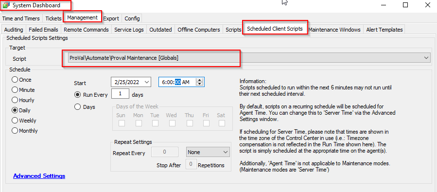

## Summary

This script cleans up old data that Automate wouldn't handle on its own.

**Time Saved by Automation:** 10 Minutes

## Sample Run

This is a client script and can be scheduled from **System > Dashboard > Manage > Scheduled Client Script.**

#### Global Parameters

| Name                                   | Example | Required | Description                                                                                     |
|----------------------------------------|---------|----------|-------------------------------------------------------------------------------------------------|
| TicketCleanup_Days                     | 90      | True     | Retention (days) of tickets in the Automate Database                                           |
| MissingDrives_Cleanup                  | 1       | True     | True/False indicating whether to clean up drives no longer detected                            |
| MissingRoles_Cleanup                   | 1       | True     | True/False indicating whether to clean up roles no longer detected, provided they are not applied roles. |
| UserCentric_Force_Contacts_Managed     | 0       | True     | True/False indicating whether to clean up old contacts (that aren't AD synced)                 |
| ScriptHistory_Cleanup                   | 1       | True     | True/False indicating whether to clean up script history based on the global retention setting   |
| EventLog_Cleanup                       | 1       | True     | True/False indicating whether to clean up event logs based on the global retention setting       |
| Commands_Cleanup                       | 1       | True     | True/False indicating whether to clean up command history based on the global retention setting  |
| MonitorHistory_Cleanup                 | 1       | True     | True/False indicating whether to clean up monitor history based on the global retention setting  |
| NetWorkDevice_Cleanup                  | 1       | True     | True/False indicating whether to purge network devices older than 60 days based on the global retention setting |
| TicketDataAdditionCleanup_Days         | 30      | True     | Retention (days) of ticket data in the Automate database.                                      |
| InactiveTicketStatus_Cleanup           | 1       | True     | True/False indicating whether to purge inactive CW Manage Ticket status(es).                    |
| PatchManagerHistory_Cleanup            | 1       | True     | True/False indicating whether to purge unnecessary historical patch manager data.               |

## Process

This script cleans up many tables in the database, in the following order of operation:

1. Ticket cleanup
2. Ticket data cleanup
3. Missing drives
4. Missing roles
5. User-centric contacts
6. Script history
7. Event logs
8. Command history
9. Monitor history
10. Network device cleanup
11. Inactive ticket status cleanup
12. Patch manager history cleanup

