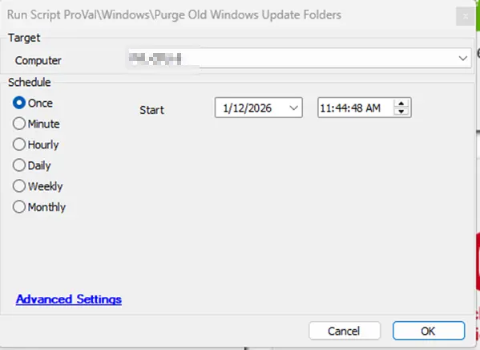

## Summary
This Script deletes old Windows Update backup folders (SoftwareDistribution.bak* and Catroot2.bak*) that haven’t been modified in a specified number of days (default 30 days)

## Sample Run

## Global Parameters

| Name                 | Default    | Description   | 
|--------------------------|----------------|--------------|
| AgeInDays   | 30 | Specifies the minimum age (in days) of backup folders; only folders last modified earlier than this value will be deleted. |

## Output

- Script Logs
