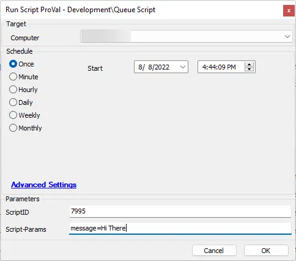

## Summary

This script will schedule a script to run on a computer the next time it checks in.

## Sample Run

## Dependencies

- [CWM - Automate - Solution - Queue Script Next Checkin](/docs/2910ca09-a0c7-4b44-8ea4-ef6e71304df8)
- [CWM - Automate - Custom Table - plugin_proval_queued_scripts](/docs/a20befa8-ecca-4cf9-9d18-c4140f87aafc)
- [CWM - Automate - Script - Run Queued Scripts](/docs/f60f4501-a2ea-43f0-87ee-99fc8ee15031)

## Variables

Document the various variables in the script. Delete any section that is not relevant to your script.

| Name             | Description                                                                 |
|------------------|-----------------------------------------------------------------------------|
| TableName        | The custom table to be created.                                            |
| GroupName        | The name of the group that is created by this script                       |
| GroupID          | The system ID for the group                                                |
| RetrievalScript   | The script ID for the Run Queued Scripts script.                          |
| ATName           | The name of the designated Autofix action. (~Autofix - Run Queued Scripts)|
| ATComment        | The comment associated with the creation of the autofix action (Automatically Created Script by @ltrunbyuser@ This was created to run @ScriptName@) |
| ATGuid           | The alert template needs a GUID statically set to (883f5185-289a-4763-8cc2-e4bf7dd1fb82) |
| AlertActionID    | Holds the ID of the created Alert Action                                    |
| AgentID          | This holds the ID of the alert action                                       |
| MonitorSQL       | This is the monitor conditions to check for the online agent.              |
| SQLInsert        | The insert statement for the process                                        |

#### User Parameters

| Name               | Example           | Required | Description                                                      |
|--------------------|-------------------|----------|------------------------------------------------------------------|
| ScriptId           | 7995              | True     | The script ID for the script you wish to schedule                |
| ScriptParameters    | message=Hi There  | False    | Any parameters that need to be passed to the above script.       |

## Process

1. Offline
   1. Create the table if it doesn't exist.
   2. If the group 'Machines with Queued Scripts' doesn't exist, create it and move on.
   3. Get the group ID for the above group.
   4. Check to see if the target machine is a member of the group; if not, add the computer to the group.
   5. Check to see if the alert template exists; if it doesn't, create it.
   6. Check to see if the alert template action exists; if not, create it.
   7. Check to see if the alert template is assigned to the group; if not, assign it.
   8. Check to see if the autofix action is assigned to the monitor; if not, assign it.
   9. Check to see if the target script exists in the custom table for that target computer; if it doesn't, add it to the custom table.
   10. Add the computer to the group.

2. Online
   1. Schedule the script to run now on the machine.

## Output

- Script log