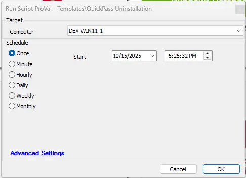

## Summary
This script can be used to silently remove the QuickPass Agent from Windows machines.

## File Hash
FilePath : `C:\ProgramData\_automation\app\Quickpass\QuickPassUninstallation.ps1`
File Hash (Sha256): `339BAE23694255DF55F51CCB2AF24CEBF84CF12988D3CB6008AE5E18FC43C4A0`
File Hash (MD5): `6B721885A9F8024B94CE803B08169F5B`

## Sample Rum

## Output
- Script Logs
- Ticketing

## Ticketing

Tickets will be generated only if the `TicketCreationCategory` value is greater than 0. Make sure to use the correct `TicketCreationCategory` to direct the tickets to the right board.

**Subject:** `QuickPass Uninstallation Failed for %ClientName%\%ComputerName% at %LocationName%`

**Ticket Body:** `Failed to uninstall QuickPass agent` .
 `Command Result: %shellresult%`